# Cluster Manager Use Cases - Class Diagrams

## Overview

This document provides comprehensive class diagrams for the SRPW-AI-BE system, organized by domain areas to support all Cluster Manager use cases.

**Architecture**: Clean Architecture with Domain-Driven Design  
**Pattern**: CQRS (Command Query Responsibility Segregation)  
**Framework**: ASP.NET Core 8.0 with Entity Framework Core

---

## 1. Domain Model - User Management & Authentication

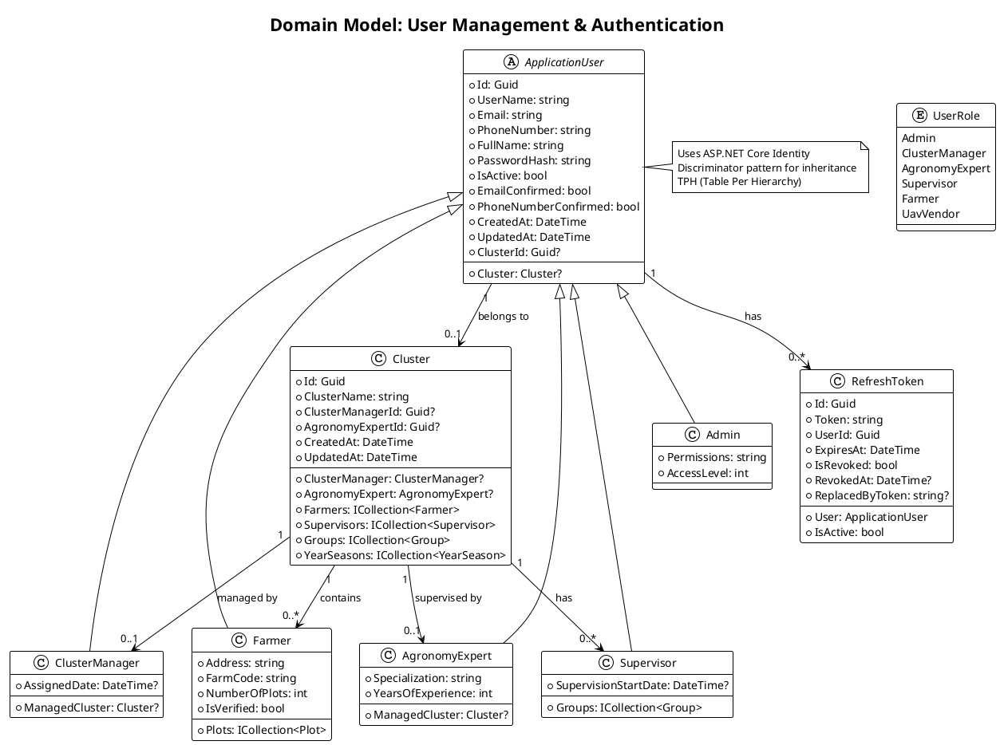

---

## 2. Domain Model - Cluster & Season Management

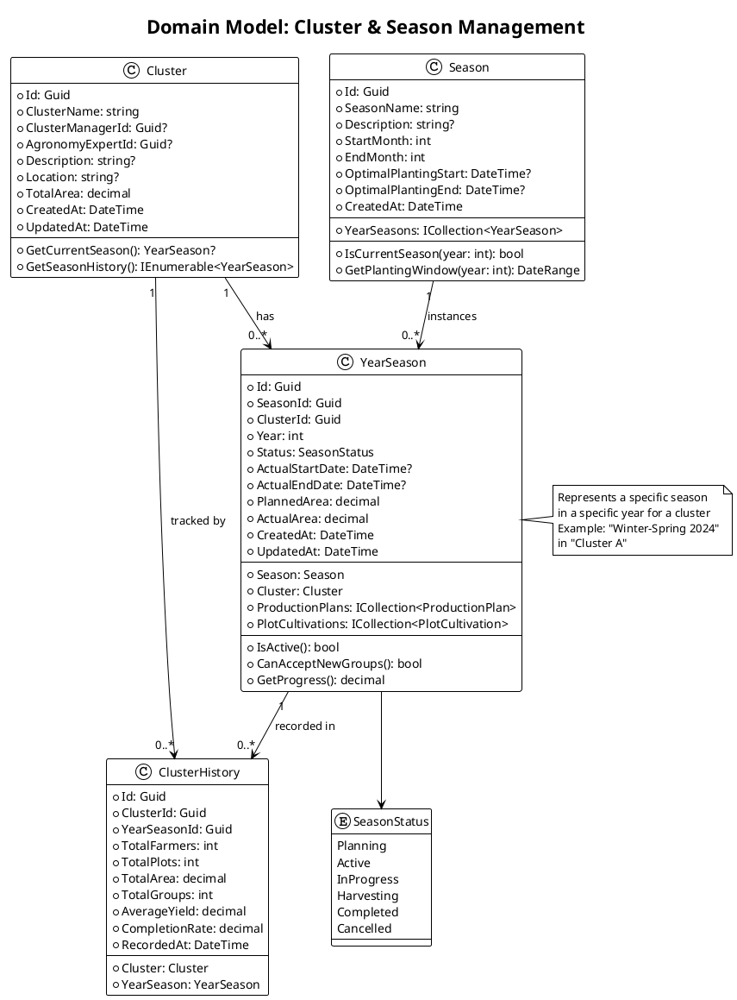

---

## 3. Domain Model - Plot & Cultivation Management

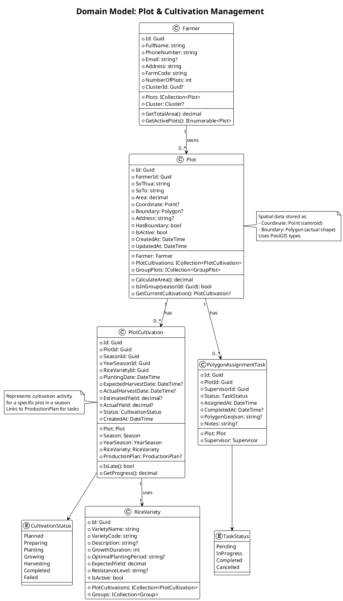

---

## 4. Domain Model - Group Formation & Management

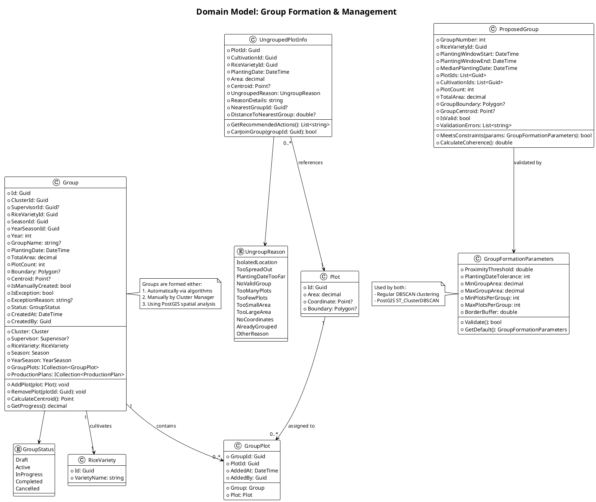

---

## 5. Domain Model - Production Plan & Task Management

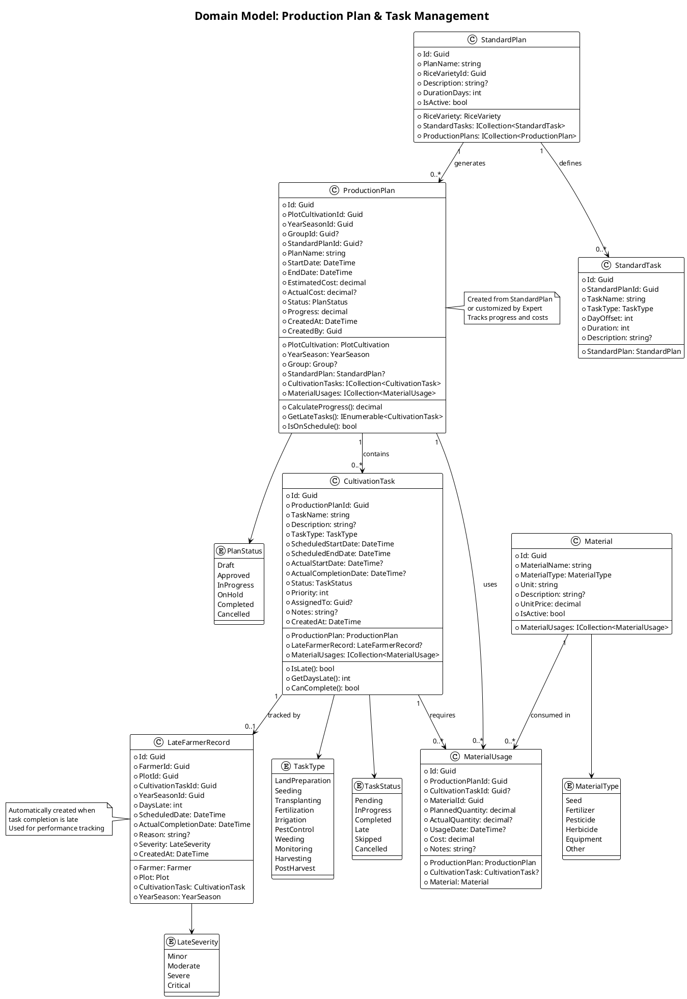

---

## 6. Application Layer - CQRS Commands (UC-CM01 to UC-CM09)

```plantuml
@startuml CQRSCommands
!theme plain
title Application Layer: CQRS Commands & Queries (UC-CM01 to UC-CM09)

package "Commands" {
  class CreateSupervisorCommand {
    + FullName: string
    + Email: string
    + PhoneNumber: string
    + ClusterId: Guid
    --
    + Validate(): ValidationResult
  }
  
  class CreateClusterCommand {
    + ClusterName: string
    + ClusterManagerId: Guid?
    + AgronomyExpertId: Guid?
    + SupervisorIds: List<Guid>
  }
}

package "Queries" {
  class GetClusterIdByManagerIdQuery {
    + ClusterManagerId: Guid
  }
  
  class GetAllSupervisorQuery {
    + SearchNameOrEmail: string?
    + SearchPhoneNumber: string?
    + CurrentPage: int
    + PageSize: int
  }
  
  class GetAllFarmerQuery {
    + PageNumber: int
    + PageSize: int
    + SearchTerm: string?
    + ClusterManagerId: Guid?
  }
  
  class GetFarmerDetailQuery {
    + FarmerId: Guid
  }
  
  class GetClusterAvailableSeasonsQuery {
    + ClusterId: Guid
    + IncludeEmpty: bool
    + Limit: int?
  }
  
  class GetClusterCurrentSeasonQuery {
    + ClusterId: Guid
  }
  
  class GetClusterHistoryQuery {
    + ClusterId: Guid
    + SeasonId: Guid?
    + Year: int?
    + Limit: int
  }
  
  class GetYearSeasonsByClusterQuery {
    + ClusterId: Guid
  }
}

package "Handlers" {
  class CreateSupervisorCommandHandler {
    - _userManager: UserManager
    - _unitOfWork: IUnitOfWork
    --
    + Handle(command: CreateSupervisorCommand): Task<Result<Guid>>
  }
  
  class GetClusterIdByManagerIdQueryHandler {
    - _unitOfWork: IUnitOfWork
    --
    + Handle(query: GetClusterIdByManagerIdQuery): Task<Result<Guid?>>
  }
  
  class GetAllSupervisorQueryHandler {
    - _unitOfWork: IUnitOfWork
    - _mapper: IMapper
    --
    + Handle(query: GetAllSupervisorQuery): Task<PagedResult<List<SupervisorResponse>>>
  }
  
  class GetFarmerDetailQueryHandler {
    - _unitOfWork: IUnitOfWork
    - _mapper: IMapper
    --
    + Handle(query: GetFarmerDetailQuery): Task<Result<FarmerDetailDTO>>
  }
  
  class GetClusterHistoryQueryHandler {
    - _unitOfWork: IUnitOfWork
    - _mapper: IMapper
    --
    + Handle(query: GetClusterHistoryQuery): Task<Result<ClusterHistoryResponse>>
  }
}

interface IRequestHandler<TRequest, TResponse> {
  + Handle(request: TRequest, cancellationToken: CancellationToken): Task<TResponse>
}

CreateSupervisorCommand ..> CreateSupervisorCommandHandler
GetClusterIdByManagerIdQuery ..> GetClusterIdByManagerIdQueryHandler
GetAllSupervisorQuery ..> GetAllSupervisorQueryHandler
GetFarmerDetailQuery ..> GetFarmerDetailQueryHandler
GetClusterHistoryQuery ..> GetClusterHistoryQueryHandler

CreateSupervisorCommandHandler ..|> IRequestHandler
GetClusterIdByManagerIdQueryHandler ..|> IRequestHandler
GetAllSupervisorQueryHandler ..|> IRequestHandler
GetFarmerDetailQueryHandler ..|> IRequestHandler
GetClusterHistoryQueryHandler ..|> IRequestHandler

note right of IRequestHandler
  MediatR pattern
  All commands and queries
  implement IRequest<TResponse>
end note

@enduml
```

---

## 7. Application Layer - Group Management Commands (UC-CM10 to UC-CM17)

```plantuml
@startuml GroupManagementCommands
!theme plain
title Application Layer: Group Management CQRS (UC-CM10 to UC-CM17)

package "Commands" {
  class FormGroupsCommand {
    + ClusterId: Guid
    + SeasonId: Guid
    + Year: int
    + Parameters: GroupFormationParameters?
    + AutoAssignSupervisors: bool
    + CreateGroupsImmediately: bool
  }
  
  class CreateGroupManuallyCommand {
    + ClusterId: Guid
    + SupervisorId: Guid
    + RiceVarietyId: Guid
    + SeasonId: Guid
    + Year: int
    + PlantingDate: DateTime
    + PlotIds: List<Guid>
    + IsException: bool
    + ExceptionReason: string?
  }
}

package "Queries" {
  class PreviewGroupsQuery {
    + ClusterId: Guid
    + SeasonId: Guid
    + Year: int
    + ProximityThreshold: double?
    + PlantingDateTolerance: int?
    + MinGroupArea: decimal?
    + MaxGroupArea: decimal?
    + MinPlotsPerGroup: int?
    + MaxPlotsPerGroup: int?
  }
  
  class GetAllGroupQuery {
  }
  
  class GetGroupsByClusterManagerIdQuery {
    + CurrentPage: int
    + PageSize: int
  }
  
  class GetGroupDetailQuery {
    + GroupId: Guid
  }
  
  class GetUngroupedPlotsQuery {
    + ClusterId: Guid
    + SeasonId: Guid
    + Year: int
  }
}

package "Handlers" {
  class FormGroupsCommandHandler {
    - _groupFormationService: IGroupFormationService
    - _postGISService: IPostGISGroupFormationService
    - _unitOfWork: IUnitOfWork
    --
    + Handle(command: FormGroupsCommand): Task<Result<FormGroupsResponse>>
    - AssignSupervisors(groups: List<Group>): Task
    - CreateGroupEntities(proposed: List<ProposedGroup>): Task
  }
  
  class FormGroupsPostGISCommandHandler {
    - _postGISService: IPostGISGroupFormationService
    - _unitOfWork: IUnitOfWork
    --
    + Handle(command: FormGroupsCommand): Task<Result<FormGroupsResponse>>
  }
  
  class CreateGroupManuallyCommandHandler {
    - _unitOfWork: IUnitOfWork
    - _mapper: IMapper
    --
    + Handle(command: CreateGroupManuallyCommand): Task<Result<Guid>>
    - ValidatePlots(plotIds: List<Guid>): Task<ValidationResult>
    - CalculateGroupMetrics(plots: List<Plot>): GroupMetrics
  }
  
  class PreviewGroupsQueryHandler {
    - _groupFormationService: IGroupFormationService
    --
    + Handle(query: PreviewGroupsQuery): Task<Result<PreviewGroupsResponse>>
  }
  
  class GetGroupDetailQueryHandler {
    - _unitOfWork: IUnitOfWork
    - _mapper: IMapper
    --
    + Handle(query: GetGroupDetailQuery): Task<Result<GroupDetailResponse>>
  }
  
  class GetUngroupedPlotsQueryHandler {
    - _unitOfWork: IUnitOfWork
    - _groupFormationService: IGroupFormationService
    --
    + Handle(query: GetUngroupedPlotsQuery): Task<Result<UngroupedPlotsResponse>>
    - AnalyzeUngroupedReasons(plots: List<Plot>): Task<List<UngroupedPlotInfo>>
  }
}

package "Services" {
  interface IGroupFormationService {
    + FormGroupsAsync(parameters: GroupFormationParameters, clusterId: Guid?, seasonId: Guid?): Task<GroupFormationResult>
    + AnalyzeUngroupedPlots(plots: List<Plot>, groups: List<Group>): Task<List<UngroupedPlotInfo>>
  }
  
  class GroupFormationService {
    - _unitOfWork: IUnitOfWork
    --
    + FormGroupsAsync(...): Task<GroupFormationResult>
    - SpatialClusteringDBSCAN(plots: List<Plot>, eps: double, minPoints: int): List<List<Plot>>
    - TemporalClustering(plots: List<Plot>, tolerance: int): List<List<Plot>>
    - ValidateGroup(plots: List<Plot>, params: GroupFormationParameters): bool
  }
  
  interface IPostGISGroupFormationService {
    + FormGroupsAsync(parameters: PostGISGroupingParameters, clusterId: Guid?, seasonId: Guid?): Task<PostGISGroupFormationResult>
  }
  
  class PostGISGroupFormationService {
    - _context: ApplicationDbContext
    --
    + FormGroupsAsync(...): Task<PostGISGroupFormationResult>
    - ExecutePostGISQuery(sql: string, parameters: Dictionary): Task<DataReader>
    - ParsePostGISResults(reader: DataReader): PostGISGroupFormationResult
  }
}

FormGroupsCommand ..> FormGroupsCommandHandler
FormGroupsCommand ..> FormGroupsPostGISCommandHandler
CreateGroupManuallyCommand ..> CreateGroupManuallyCommandHandler
PreviewGroupsQuery ..> PreviewGroupsQueryHandler
GetGroupDetailQuery ..> GetGroupDetailQueryHandler
GetUngroupedPlotsQuery ..> GetUngroupedPlotsQueryHandler

FormGroupsCommandHandler --> IGroupFormationService
FormGroupsCommandHandler --> IPostGISGroupFormationService
FormGroupsPostGISCommandHandler --> IPostGISGroupFormationService
PreviewGroupsQueryHandler --> IGroupFormationService
GetUngroupedPlotsQueryHandler --> IGroupFormationService

IGroupFormationService <|.. GroupFormationService
IPostGISGroupFormationService <|.. PostGISGroupFormationService

note right of FormGroupsCommandHandler
  Can use either:
  1. In-memory DBSCAN clustering
  2. PostGIS spatial clustering
  Based on configuration
end note

note left of PreviewGroupsQueryHandler
  Read-only operation
  No database changes
  Used for preview before creation
end note

@enduml
```

---

## 8. Application Layer - Plot & Performance Tracking (UC-CM18 to UC-CM20)

```plantuml
@startuml PlotPerformanceTracking
!theme plain
title Application Layer: Plot & Performance Tracking (UC-CM18 to UC-CM20)

package "Queries" {
  class GetAllPlotQuery {
    + PageNumber: int
    + PageSize: int
    + SearchTerm: string?
    + ClusterManagerId: Guid?
  }
  
  class GetLateFarmersInClusterQuery {
    + AgronomyExpertId: Guid?
    + SupervisorId: Guid?
    + PageNumber: int
    + PageSize: int
    + SearchTerm: string?
  }
  
  class GetLatePlotsInClusterQuery {
    + AgronomyExpertId: Guid?
    + SupervisorId: Guid?
    + PageNumber: int
    + PageSize: int
    + SearchTerm: string?
  }
  
  class GetLateCountByFarmerIdQuery {
    + FarmerId: Guid
  }
  
  class GetLateDetailByFarmerIdQuery {
    + FarmerId: Guid
  }
  
  class GetLateCountByPlotIdQuery {
    + PlotId: Guid
  }
}

package "Commands" {
  class CreateLateFarmerRecordCommand {
    + CultivationTaskId: Guid
    + Reason: string?
  }
}

package "Handlers" {
  class GetAllPlotQueryHandler {
    - _unitOfWork: IUnitOfWork
    - _mapper: IMapper
    --
    + Handle(query: GetAllPlotQuery): Task<PagedResult<List<PlotDTO>>>
  }
  
  class GetLateFarmersInClusterQueryHandler {
    - _unitOfWork: IUnitOfWork
    - _mapper: IMapper
    --
    + Handle(query: GetLateFarmersInClusterQuery): Task<PagedResult<List<FarmerWithLateCountDTO>>>
    - GetClusterIdFromExpertOrSupervisor(expertId: Guid?, supervisorId: Guid?): Task<Guid>
    - CalculateLateSeverity(lateCount: int, totalTasks: int): LateSeverity
  }
  
  class GetLatePlotsInClusterQueryHandler {
    - _unitOfWork: IUnitOfWork
    - _mapper: IMapper
    --
    + Handle(query: GetLatePlotsInClusterQuery): Task<PagedResult<List<PlotWithLateCountDTO>>>
    - GetLatePlotStatistics(plotId: Guid): Task<PlotLateStatistics>
    - GetRecommendations(plotStats: PlotLateStatistics): List<string>
  }
  
  class CreateLateFarmerRecordCommandHandler {
    - _unitOfWork: IUnitOfWork
    --
    + Handle(command: CreateLateFarmerRecordCommand): Task<Result<Guid>>
    - CalculateDaysLate(task: CultivationTask): int
    - DetermineSeverity(daysLate: int): LateSeverity
  }
}

package "DTOs" {
  class PlotDTO {
    + Id: Guid
    + SoThua: string
    + SoTo: string
    + Area: decimal
    + FarmerId: Guid
    + FarmerName: string
    + FarmerPhone: string?
    + ClusterId: Guid?
    + ClusterName: string?
    + HasBoundary: bool
    + Coordinate: CoordinateDto?
  }
  
  class FarmerWithLateCountDTO {
    + FarmerId: Guid
    + FullName: string
    + PhoneNumber: string
    + Email: string?
    + LateCount: int
    + TotalTasks: int
    + LatePercentage: decimal
    + LastLateDate: DateTime?
    + Severity: LateSeverity
    + ClusterId: Guid
    + ClusterName: string
  }
  
  class PlotWithLateCountDTO {
    + PlotId: Guid
    + SoThua: string
    + SoTo: string
    + Area: decimal
    + FarmerId: Guid
    + FarmerName: string
    + FarmerPhone: string
    + LateCount: int
    + TotalTasks: int
    + LatePercentage: decimal
    + LastLateDate: DateTime?
    + LateTasks: List<string>
    + Recommendations: List<string>
  }
  
  class FarmerLateCountDTO {
    + FarmerId: Guid
    + FullName: string
    + TotalLateRecords: int
    + LatestLateRecord: DateTime?
  }
  
  class PlotLateCountDTO {
    + PlotId: Guid
    + SoThua: string
    + SoTo: string
    + TotalLateRecords: int
  }
  
  class FarmerLateDetailDTO {
    + FarmerId: Guid
    + FullName: string
    + PhoneNumber: string
    + TotalLateRecords: int
    + LateRecords: List<LateFarmerRecordDTO>
  }
}

GetAllPlotQuery ..> GetAllPlotQueryHandler
GetLateFarmersInClusterQuery ..> GetLateFarmersInClusterQueryHandler
GetLatePlotsInClusterQuery ..> GetLatePlotsInClusterQueryHandler
CreateLateFarmerRecordCommand ..> CreateLateFarmerRecordCommandHandler

GetAllPlotQueryHandler ..> PlotDTO
GetLateFarmersInClusterQueryHandler ..> FarmerWithLateCountDTO
GetLatePlotsInClusterQueryHandler ..> PlotWithLateCountDTO

note right of GetLateFarmersInClusterQueryHandler
  Complex aggregation query
  Groups late records by farmer
  Calculates performance metrics
  Ranks by severity
end note

note left of PlotWithLateCountDTO
  Includes recommendations:
  - Increase monitoring
  - Provide additional support
  - Adjust planting schedule
  - Assign different supervisor
end note

@enduml
```

---

## 9. Infrastructure Layer - Repositories & Unit of Work

```plantuml
@startuml RepositoryPattern
!theme plain
title Infrastructure Layer: Repository Pattern & Unit of Work

interface IRepository<T> {
  + GetByIdAsync(id: Guid): Task<T?>
  + GetAllAsync(): Task<IEnumerable<T>>
  + FindAsync(predicate: Expression<Func<T, bool>>): Task<T?>
  + AddAsync(entity: T): Task
  + AddRangeAsync(entities: IEnumerable<T>): Task
  + UpdateAsync(entity: T): Task
  + DeleteAsync(id: Guid): Task
  + GenerateNewGuid(guid: Guid): Task<Guid>
}

class Repository<T> {
  # _context: ApplicationDbContext
  # _dbSet: DbSet<T>
  --
  + GetByIdAsync(id: Guid): Task<T?>
  + GetAllAsync(): Task<IEnumerable<T>>
  + FindAsync(predicate: Expression<Func<T, bool>>): Task<T?>
  + AddAsync(entity: T): Task
  + UpdateAsync(entity: T): Task
  + DeleteAsync(id: Guid): Task
}

interface IClusterManagerRepository {
  + GetClusterManagerByIdAsync(id: Guid): Task<ClusterManager?>
  + GetClusterIdByManagerId(managerId: Guid): Task<Guid?>
  + GetFreeClusterManagers(): Task<IEnumerable<ClusterManager>>
  + GetClusterManagersWithPaging(page: int, size: int, search: string?): Task<PagedResult<ClusterManager>>
}

class ClusterManagerRepository {
  - _context: ApplicationDbContext
  --
  + GetClusterManagerByIdAsync(id: Guid): Task<ClusterManager?>
  + GetClusterIdByManagerId(managerId: Guid): Task<Guid?>
}

interface IFarmerRepository {
  + GetFarmerByIdAsync(id: Guid): Task<Farmer?>
  + GetFarmerByPhoneNumber(phone: string): Task<Farmer?>
  + GetFarmersWithPaging(page: int, size: int, search: string?, managerId: Guid?): Task<PagedResult<Farmer>>
  + GetFarmerDetailAsync(id: Guid): Task<FarmerDetailDTO?>
}

interface IPlotRepository {
  + GetPlotsByFarmerId(farmerId: Guid): Task<IEnumerable<Plot>>
  + GetPlotsByClusterId(clusterId: Guid): Task<IEnumerable<Plot>>
  + GetPlotsWithBoundary(): Task<IEnumerable<Plot>>
  + GetPlotsNotInGroups(clusterId: Guid, seasonId: Guid, year: int): Task<IEnumerable<Plot>>
  + GetPlotsAwaitingPolygon(filters: PlotFilters): Task<PagedResult<Plot>>
}

interface IGroupRepository {
  + GetGroupByIdWithDetails(id: Guid): Task<Group?>
  + GetGroupsByClusterId(clusterId: Guid): Task<IEnumerable<Group>>
  + GetGroupsBySeasonId(seasonId: Guid): Task<IEnumerable<Group>>
  + GetNearbyGroups(coordinate: Point, riceVarietyId: Guid, limit: int): Task<IEnumerable<Group>>
}

interface ISupervisorRepository {
  + GetSupervisorsByClusterId(clusterId: Guid): Task<IEnumerable<Supervisor>>
  + GetAvailableSupervisors(clusterId: Guid, seasonId: Guid): Task<IEnumerable<Supervisor>>
  + GetSupervisorWorkload(supervisorId: Guid, seasonId: Guid): Task<SupervisorWorkload>
}

interface IYearSeasonRepository {
  + GetByClusterIdAsync(clusterId: Guid): Task<IEnumerable<YearSeason>>
  + GetCurrentSeasonForCluster(clusterId: Guid): Task<YearSeason?>
  + GetClusterHistory(clusterId: Guid, filters: HistoryFilters): Task<IEnumerable<YearSeason>>
}

interface ILateFarmerRecordRepository {
  + GetByFarmerIdAsync(farmerId: Guid): Task<IEnumerable<LateFarmerRecord>>
  + GetByPlotIdAsync(plotId: Guid): Task<IEnumerable<LateFarmerRecord>>
  + GetLateFarmersInCluster(clusterId: Guid, filters: LateFilters): Task<PagedResult<LateFarmerRecord>>
  + GetLatePlotsInCluster(clusterId: Guid, filters: LateFilters): Task<PagedResult<LateFarmerRecord>>
}

interface IUnitOfWork {
  + Repository<T>(): IRepository<T>
  + ClusterRepository: IRepository<Cluster>
  + ClusterManagerRepository: IClusterManagerRepository
  + FarmerRepository: IFarmerRepository
  + PlotRepository: IPlotRepository
  + GroupRepository: IGroupRepository
  + SupervisorRepository: ISupervisorRepository
  + YearSeasonRepository: IYearSeasonRepository
  + LateFarmerRecordRepository: ILateFarmerRecordRepository
  + ProductionPlanRepository: IRepository<ProductionPlan>
  + CultivationTaskRepository: IRepository<CultivationTask>
  --
  + SaveChangesAsync(cancellationToken: CancellationToken): Task<int>
  + BeginTransactionAsync(): Task<IDbContextTransaction>
  + CommitAsync(): Task
  + RollbackAsync(): Task
}

class UnitOfWork {
  - _context: ApplicationDbContext
  - _repositories: Dictionary<Type, object>
  - _transaction: IDbContextTransaction?
  --
  + Repository<T>(): IRepository<T>
  + SaveChangesAsync(cancellationToken: CancellationToken): Task<int>
  + BeginTransactionAsync(): Task<IDbContextTransaction>
  + Dispose(): void
}

IRepository <|.. Repository
IClusterManagerRepository <|.. ClusterManagerRepository
Repository <|-- ClusterManagerRepository

IUnitOfWork <|.. UnitOfWork
UnitOfWork --> IClusterManagerRepository
UnitOfWork --> IFarmerRepository
UnitOfWork --> IPlotRepository
UnitOfWork --> IGroupRepository
UnitOfWork --> ISupervisorRepository
UnitOfWork --> IYearSeasonRepository
UnitOfWork --> ILateFarmerRecordRepository

note right of IUnitOfWork
  Manages database transactions
  Provides access to all repositories
  Ensures consistency across operations
end note

note left of Repository
  Generic base repository
  Common CRUD operations
  Used by all specific repositories
end note

@enduml
```

---

## 10. Infrastructure Layer - Services & External Integrations

```plantuml
@startuml InfrastructureServices
!theme plain
title Infrastructure Layer: Services & External Integrations

package "Spatial Services" {
  interface IPostGISGroupFormationService {
    + FormGroupsAsync(parameters: PostGISGroupingParameters, clusterId: Guid?, seasonId: Guid?): Task<PostGISGroupFormationResult>
  }
  
  class PostGISGroupFormationService {
    - _context: ApplicationDbContext
    --
    + FormGroupsAsync(...): Task<PostGISGroupFormationResult>
    - ExecuteSpatialQuery(sql: string): Task<DataReader>
    - ParseSpatialResults(reader: DataReader): PostGISGroupFormationResult
  }
  
  interface ISpatialService {
    + CalculateDistance(point1: Point, point2: Point): double
    + CalculateCentroid(polygons: List<Polygon>): Point
    + UnionPolygons(polygons: List<Polygon>): Polygon
    + BufferPolygon(polygon: Polygon, distance: double): Polygon
    + IsWithinDistance(point1: Point, point2: Point, threshold: double): bool
  }
  
  class PostGISSpatialService {
    - _context: ApplicationDbContext
    --
    + CalculateDistance(point1: Point, point2: Point): double
    + CalculateCentroid(polygons: List<Polygon>): Point
    - ConvertToWKT(geometry: Geometry): string
    - ConvertFromWKT(wkt: string): Geometry
  }
}

package "Identity Services" {
  interface IIdentityService {
    + LoginAsync(emailOrPhone: string, password: string, isEmail: bool): Task<AuthenticationResult>
    + LogoutAsync(userId: Guid, refreshToken: string?): Task<Result>
    + CreateUserAsync(user: ApplicationUser, password: string, role: string): Task<Result<Guid>>
    + GetUserByIdAsync(userId: Guid): Task<ApplicationUser?>
    + RevokeAllUserTokensAsync(userId: Guid): Task<Result>
  }
  
  class IdentityService {
    - _userManager: UserManager<ApplicationUser>
    - _signInManager: SignInManager<ApplicationUser>
    - _tokenService: ITokenService
    - _context: ApplicationDbContext
    --
    + LoginAsync(...): Task<AuthenticationResult>
    + LogoutAsync(...): Task<Result>
    + CreateUserAsync(...): Task<Result<Guid>>
  }
  
  interface ITokenService {
    + GenerateAccessToken(userId: Guid, userName: string, email: string, roles: IList<string>): string
    + GenerateRefreshToken(): string
    + GetPrincipalFromExpiredToken(token: string): ClaimsPrincipal?
    + ValidateToken(token: string): bool
    + GetTokenExpiration(token: string): DateTime
  }
  
  class TokenService {
    - _jwtSecret: string
    - _issuer: string
    - _audience: string
    - _accessTokenExpirationMinutes: int
    --
    + GenerateAccessToken(...): string
    + GenerateRefreshToken(): string
    + ValidateToken(token: string): bool
  }
}

package "Notification Services" {
  interface IEmailService {
    + SendEmailAsync(request: SimpleEmailRequest, cancellationToken: CancellationToken): Task<Result<EmailResponse>>
    + SendBulkEmailAsync(requests: List<SimpleEmailRequest>, cancellationToken: CancellationToken): Task<Result<EmailBatchResult>>
  }
  
  class InfobipEmailService {
    - _httpClient: HttpClient
    - _apiKey: string
    - _context: ApplicationDbContext
    --
    + SendEmailAsync(...): Task<Result<EmailResponse>>
    + SendBulkEmailAsync(...): Task<Result<EmailBatchResult>>
    - TrackEmailInDatabase(email: EmailMessage): Task
  }
  
  interface ISmsService {
    + SendSmsAsync(phoneNumber: string, message: string): Task<Result<SmsResponse>>
    + SendBulkSmsAsync(requests: List<SmsRequest>): Task<Result<SmsBatchResult>>
  }
  
  class InfobipSmsService {
    - _httpClient: HttpClient
    - _apiKey: string
    --
    + SendSmsAsync(...): Task<Result<SmsResponse>>
    + SendBulkSmsAsync(...): Task<Result<SmsBatchResult>>
  }
}

package "Excel Services" {
  interface IFarmerExcel {
    + ImportFarmerFromExcelAsync(file: IFormFile, clusterManagerId: Guid?, cancellationToken: CancellationToken): Task<ImportFarmerResult>
    + ExportFarmersToExcelAsync(farmers: List<Farmer>): Task<byte[]>
  }
  
  class FarmerExcelImplement {
    - _userManager: UserManager<ApplicationUser>
    - _context: ApplicationDbContext
    --
    + ImportFarmerFromExcelAsync(...): Task<ImportFarmerResult>
    - ValidateExcelRow(row: FarmerDTO): ValidationResult
    - CreateFarmerAccount(dto: FarmerDTO, clusterId: Guid): Task<Farmer>
  }
  
  interface IPlotExcel {
    + ImportPlotFromExcelAsync(file: IFormFile, cancellationToken: CancellationToken): Task<ImportPlotResult>
    + ExportPlotsToExcelAsync(plots: List<Plot>): Task<byte[]>
  }
}

IPostGISGroupFormationService <|.. PostGISGroupFormationService
ISpatialService <|.. PostGISSpatialService
IIdentityService <|.. IdentityService
ITokenService <|.. TokenService
IEmailService <|.. InfobipEmailService
ISmsService <|.. InfobipSmsService
IFarmerExcel <|.. FarmerExcelImplement

IdentityService --> ITokenService
InfobipEmailService --> IEmailService
FarmerExcelImplement --> IIdentityService

note right of PostGISGroupFormationService
  Uses native PostGIS functions:
  - ST_ClusterDBSCAN
  - ST_Distance
  - ST_Union
  - ST_Centroid
  - ST_Buffer
end note

note left of InfobipEmailService
  External API integration
  Tracks emails in database
  Handles batch sending
  Error handling & retry logic
end note

@enduml
```

---

## 11. API Layer - Controllers & DTOs

```plantuml
@startuml APILayer
!theme plain
title API Layer: Controllers, Requests & Responses

package "Controllers" {
  class ClusterManagerController {
    - _mediator: IMediator
    - _logger: ILogger
    --
    + GetClusterManagersPagingAndSearch(request: ClusterManagerListRequest): Task<ActionResult>
    + CreateClusterManager(command: CreateClusterManagerCommand): Task<IActionResult>
    + GetClusterManagerById(clusterManagerId: Guid): Task<IActionResult>
    + GetClusterIdByManagerId(clusterManagerId: Guid): Task<IActionResult>
  }
  
  class SupervisorController {
    - _mediator: IMediator
    - _logger: ILogger
    --
    + GetAllSupervisorOfAClusterPaging(request: SupervisorListRequest): Task<ActionResult>
    + CreateSupervisorCommand(command: CreateSupervisorCommand): Task<IActionResult>
    + GetMyPolygonTasks(status: string?): Task<ActionResult>
    + GetGroupBySeason(seasonId: Guid?, year: int?): Task<ActionResult>
  }
  
  class FarmerController {
    - _mediator: IMediator
    - _logger: ILogger
    - _currentUser: IUser
    --
    + GetFarmerById(id: Guid): Task<ActionResult>
    + GetFarmerDetailById(id: Guid): Task<ActionResult>
    + GetAllFarmers(pageNumber: int, pageSize: int, searchTerm: string?, clusterManagerId: Guid?): Task<ActionResult>
    + ImportFarmers(requestModel: FileUploadRequest): Task<IActionResult>
    + CreateFarmer(command: CreateFarmersCommand): Task<IActionResult>
  }
  
  class GroupController {
    - _mediator: IMediator
    - _currentUser: IUser
    --
    + GetGroupsByClusterIdPaging(request: GroupListRequest): Task<ActionResult>
    + GetGroupDetail(id: Guid): Task<IActionResult>
    + GetAllGroups(): Task<IActionResult>
    + PreviewGroups(clusterId: Guid, seasonId: Guid, year: int, parameters...): Task<IActionResult>
    + FormGroups(request: FormGroupsRequest): Task<IActionResult>
    + CreateGroupManually(request: CreateGroupManuallyRequest): Task<IActionResult>
  }
  
  class PlotController {
    - _mediator: IMediator
    - _logger: ILogger
    - _currentUser: IUser
    --
    + GetPlotById(id: Guid): Task<ActionResult>
    + GetAllPlots(pageNumber: int, pageSize: int, searchTerm: string?, clusterManagerId: Guid?): Task<ActionResult>
    + CreatePlot(command: CreatePlotCommand): Task<IActionResult>
    + ImportPlotsFromExcel(excelFile: IFormFile, importDate: DateTime?): Task<IActionResult>
    + GetPlotsAwaitingPolygon(filters...): Task<IActionResult>
  }
  
  class LateFarmerRecordController {
    - _mediator: IMediator
    - _logger: ILogger
    --
    + CreateLateFarmerRecord(command: CreateLateFarmerRecordCommand): Task<ActionResult>
    + GetLateCountByFarmerId(farmerId: Guid): Task<ActionResult>
    + GetLateDetailByFarmerId(farmerId: Guid): Task<ActionResult>
    + GetLateCountByPlotId(plotId: Guid): Task<ActionResult>
    + GetLateFarmersInCluster(agronomyExpertId: Guid?, supervisorId: Guid?, filters...): Task<ActionResult>
    + GetLatePlotsInCluster(agronomyExpertId: Guid?, supervisorId: Guid?, filters...): Task<ActionResult>
  }
  
  class ClusterController {
    - _mediator: IMediator
    - _logger: ILogger
    --
    + CreateCluster(command: CreateClusterCommand): Task<IActionResult>
    + GetAllClusters(request: ClusterListRequest): Task<ActionResult>
    + GetClusterHistory(clusterId: Guid, seasonId: Guid?, year: int?, limit: int?): Task<ActionResult>
    + GetClusterCurrentSeason(clusterId: Guid): Task<ActionResult>
    + GetClusterAvailableSeasons(clusterId: Guid, includeEmpty: bool, limit: int?): Task<ActionResult>
  }
}

package "Request DTOs" {
  class ClusterManagerListRequest {
    + CurrentPage: int
    + PageSize: int
    + Search: string?
    + PhoneNumber: string?
    + FreeOrAssigned: bool?
  }
  
  class SupervisorListRequest {
    + SearchNameOrEmail: string?
    + SearchPhoneNumber: string?
    + CurrentPage: int
    + PageSize: int
  }
  
  class GroupListRequest {
    + CurrentPage: int
    + PageSize: int
  }
  
  class FormGroupsRequest {
    + ClusterId: Guid
    + SeasonId: Guid
    + Year: int
    + Parameters: GroupFormationParametersDto?
    + AutoAssignSupervisors: bool
    + CreateGroupsImmediately: bool
  }
  
  class CreateGroupManuallyRequest {
    + ClusterId: Guid
    + SupervisorId: Guid
    + RiceVarietyId: Guid
    + SeasonId: Guid
    + Year: int
    + PlantingDate: DateTime
    + PlotIds: List<Guid>
    + IsException: bool
    + ExceptionReason: string?
  }
}

package "Response DTOs" {
  class SupervisorResponse {
    + Id: Guid
    + FullName: string
    + Email: string
    + PhoneNumber: string
    + ClusterId: Guid?
    + ClusterName: string?
    + IsActive: bool
    + CreatedAt: DateTime
  }
  
  class FarmerDTO {
    + Id: Guid
    + FullName: string
    + PhoneNumber: string
    + Email: string?
    + Address: string
    + FarmCode: string
    + ClusterId: Guid?
    + ClusterName: string?
    + NumberOfPlots: int
    + IsActive: bool
  }
  
  class FarmerDetailDTO {
    + Id: Guid
    + FullName: string
    + PhoneNumber: string
    + Email: string?
    + Address: string
    + FarmCode: string
    + ClusterId: Guid?
    + ClusterName: string?
    + Plots: List<PlotDTO>
    + CultivationHistory: List<CultivationHistoryDTO>
    + PerformanceMetrics: PerformanceMetricsDTO
  }
  
  class GroupResponse {
    + Id: Guid
    + ClusterId: Guid
    + ClusterName: string
    + SupervisorId: Guid?
    + SupervisorName: string?
    + RiceVarietyId: Guid
    + RiceVarietyName: string
    + SeasonName: string
    + Year: int
    + PlantingDate: DateTime
    + PlotCount: int
    + TotalArea: decimal
    + Status: string
    + CreatedAt: DateTime
  }
  
  class GroupDetailResponse {
    + Id: Guid
    + GroupName: string?
    + ClusterInfo: ClusterInfoDTO
    + SupervisorInfo: SupervisorInfoDTO?
    + RiceVarietyInfo: RiceVarietyInfoDTO
    + SeasonInfo: SeasonInfoDTO
    + Plots: List<PlotWithFarmerDTO>
    + ProductionPlans: List<ProductionPlanSummaryDTO>
    + Statistics: GroupStatisticsDTO
    + BoundaryGeoJson: string?
  }
  
  class FormGroupsResponse {
    + TotalGroupsCreated: int
    + TotalPlotsGrouped: int
    + TotalUngroupedPlots: int
    + TotalArea: decimal
    + Groups: List<GroupSummaryDTO>
    + UngroupedPlots: List<UngroupedPlotSummaryDTO>
    + Statistics: FormationStatisticsDTO
  }
  
  class PreviewGroupsResponse {
    + ProposedGroups: List<ProposedGroupDTO>
    + UngroupedPlots: List<UngroupedPlotDTO>
    + Statistics: PreviewStatisticsDTO
    + Recommendations: List<string>
  }
}

ClusterManagerController --> ClusterManagerListRequest
SupervisorController --> SupervisorListRequest
SupervisorController --> SupervisorResponse
GroupController --> GroupListRequest
GroupController --> FormGroupsRequest
GroupController --> GroupResponse
GroupController --> GroupDetailResponse
GroupController --> FormGroupsResponse
GroupController --> PreviewGroupsResponse
FarmerController --> FarmerDTO
FarmerController --> FarmerDetailDTO

note right of ClusterManagerController
  All controllers use MediatR
  Send commands/queries to handlers
  Return standardized Result<T>
end note

note left of FormGroupsResponse
  Contains complete information:
  - Created groups
  - Ungrouped plots with reasons
  - Statistics and metrics
  - Recommendations
end note

@enduml
```

---

## 12. Complete System Architecture Overview

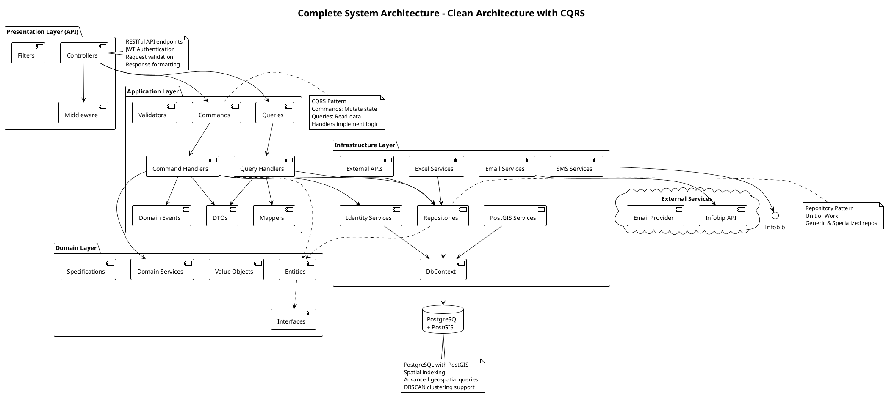

---

## Summary

This document provides comprehensive class diagrams covering all aspects of the SRPW-AI-BE system that support the 20 Cluster Manager use cases:

### Domain Models (Diagrams 1-5):
1. **User Management & Authentication** - Identity, roles, tokens
2. **Cluster & Season Management** - Cluster organization, season tracking
3. **Plot & Cultivation** - Plot management, cultivation tracking
4. **Group Formation** - Automatic & manual grouping, spatial clustering
5. **Production & Tasks** - Plans, tasks, late tracking

### Application Layer (Diagrams 6-8):
6. **Basic CQRS Commands** - UC-CM01 to UC-CM09
7. **Group Management CQRS** - UC-CM10 to UC-CM17  
8. **Plot & Performance CQRS** - UC-CM18 to UC-CM20

### Infrastructure Layer (Diagrams 9-10):
9. **Repository Pattern** - Data access abstraction
10. **Services** - PostGIS, Identity, Email, SMS, Excel

### API Layer (Diagram 11):
11. **Controllers & DTOs** - Request/Response models

### Complete Overview (Diagram 12):
12. **System Architecture** - Clean Architecture visualization

Each diagram shows:
- Class properties and methods
- Relationships (inheritance, composition, association)
- Key interfaces and implementations
- Enumerations
- Design patterns applied
- Notes explaining important concepts

---

*Generated for SRPW-AI-BE Project*  
*Class Diagrams for Cluster Manager Use Cases*  
*Date: December 14, 2025*

