# Cluster Manager Use Cases - Class Diagrams (Grouped by Feature)

## Overview

This document provides class diagrams organized by **feature domains**, where each diagram covers all related use cases within that feature area. This approach shows the complete domain model, commands, queries, and services needed for each business feature.

**Architecture**: Clean Architecture with CQRS (MediatR)  
**Database**: PostgreSQL with PostGIS  
**Framework**: ASP.NET Core 8.0

---

## Feature 1: Cluster & Season Management

**Covers Use Cases:**
- **UC-CM01**: Get Cluster ID By Manager ID
- **UC-CM06**: Get Cluster Available Seasons
- **UC-CM07**: Get Cluster Current Season
- **UC-CM08**: Get Cluster History
- **UC-CM09**: Get Year Seasons By Cluster

```plantuml
@startuml ClusterSeasonFeature
!theme plain
title Feature: Cluster & Season Management (UC-CM01, UC-CM06, UC-CM07, UC-CM08, UC-CM09)

' ================== INFRASTRUCTURE INTERFACES ==================
package "Infrastructure Interfaces" {
  interface IMediator {
    + Send<TResponse>(request: IRequest<TResponse>): Task<TResponse>
    + Publish<TNotification>(notification: TNotification): Task
  }
  
  interface IMapper {
    + Map<TDestination>(source: object): TDestination
    + Map<TSource, TDestination>(source: TSource, destination: TDestination): TDestination
  }
  
  interface ILogger<T> {
    + LogInformation(message: string, args: object[]): void
    + LogWarning(message: string, args: object[]): void
    + LogError(exception: Exception, message: string, args: object[]): void
  }
  
  interface IUnitOfWork {
    + SaveChangesAsync(cancellationToken: CancellationToken): Task<int>
    + BeginTransactionAsync(): Task<IDbContextTransaction>
  }
}

' ================== DOMAIN ENTITIES ==================
package "Domain Entities" {
  class Cluster {
    + Id: Guid
    + ClusterName: string
    + ClusterManagerId: Guid?
    + AgronomyExpertId: Guid?
    + Description: string?
    + TotalArea: decimal
    + CreatedAt: DateTime
    + UpdatedAt: DateTime
    --
    + ClusterManager: ClusterManager?
    + AgronomyExpert: AgronomyExpert?
    + YearSeasons: ICollection<YearSeason>
    + Farmers: ICollection<Farmer>
    + Groups: ICollection<Group>
    --
    + GetCurrentSeason(): YearSeason?
    + GetSeasonHistory(filters): IEnumerable<YearSeason>
  }

  class ClusterManager {
    + Id: Guid
    + FullName: string
    + Email: string
    + PhoneNumber: string
    + ClusterId: Guid?
    + IsActive: bool
    --
    + ManagedCluster: Cluster?
  }

  class Season {
    + Id: Guid
    + SeasonName: string
    + Description: string?
    + StartMonth: int
    + EndMonth: int
    + OptimalPlantingStart: DateTime?
    + OptimalPlantingEnd: DateTime?
    --
    + YearSeasons: ICollection<YearSeason>
    --
    + IsCurrentSeason(year: int): bool
  }

  class YearSeason {
    + Id: Guid
    + SeasonId: Guid
    + ClusterId: Guid
    + Year: int
    + Status: SeasonStatus
    + ActualStartDate: DateTime?
    + ActualEndDate: DateTime?
    + PlannedArea: decimal
    + ActualArea: decimal
    + CreatedAt: DateTime
    --
    + Season: Season
    + Cluster: Cluster
    + ProductionPlans: ICollection<ProductionPlan>
    + PlotCultivations: ICollection<PlotCultivation>
    --
    + IsActive(): bool
    + GetProgress(): decimal
  }

  enum SeasonStatus {
    Planning
    Active
    InProgress
    Harvesting
    Completed
    Cancelled
  }

  class ClusterHistory {
    + Id: Guid
    + ClusterId: Guid
    + YearSeasonId: Guid
    + TotalFarmers: int
    + TotalPlots: int
    + TotalArea: decimal
    + TotalGroups: int
    + AverageYield: decimal
    + CompletionRate: decimal
    + RecordedAt: DateTime
    --
    + Cluster: Cluster
    + YearSeason: YearSeason
  }

  Cluster "1" --> "0..1" ClusterManager : managed by
  Cluster "1" --> "0..*" YearSeason : has
  Season "1" --> "0..*" YearSeason : instances
  YearSeason --> SeasonStatus
  Cluster "1" --> "0..*" ClusterHistory : tracked by
  YearSeason "1" --> "0..*" ClusterHistory : recorded in
}

' ================== CQRS - QUERIES ==================
package "Queries (Read Operations)" {
  class GetClusterIdByManagerIdQuery {
    + ClusterManagerId: Guid
  }

  class GetClusterAvailableSeasonsQuery {
    + ClusterId: Guid
    + IncludeEmpty: bool
    + Limit: int?
  }

  class GetClusterCurrentSeasonQuery {
    + ClusterId: Guid
  }

  class GetClusterHistoryQuery {
    + ClusterId: Guid
    + SeasonId: Guid?
    + Year: int?
    + Limit: int
  }

  class GetYearSeasonsByClusterQuery {
    + ClusterId: Guid
  }
}

' ================== QUERY HANDLERS ==================
package "Query Handlers" {
  class GetClusterIdByManagerIdQueryHandler {
    - _clusterManagerRepo: IClusterManagerRepository
    --
    + Handle(query): Task<Result<Guid?>>
  }

  class GetClusterAvailableSeasonsQueryHandler {
    - _yearSeasonRepo: IYearSeasonRepository
    - _productionPlanRepo: IProductionPlanRepository
    - _mapper: IMapper
    --
    + Handle(query): Task<Result<ClusterSeasonsResponse>>
    - FilterAndMapSeasons(seasons, includeEmpty): List<SeasonDTO>
  }

  class GetClusterCurrentSeasonQueryHandler {
    - _yearSeasonRepo: IYearSeasonRepository
    - _productionPlanRepo: IProductionPlanRepository
    - _mapper: IMapper
    --
    + Handle(query): Task<Result<ClusterCurrentSeasonResponse>>
    - GetSeasonStatistics(yearSeasonId): Task<SeasonStatistics>
  }

  class GetClusterHistoryQueryHandler {
    - _yearSeasonRepo: IYearSeasonRepository
    - _plotCultivationRepo: IPlotCultivationRepository
    - _mapper: IMapper
    --
    + Handle(query): Task<Result<ClusterHistoryResponse>>
    - GetSeasonSummary(yearSeasonId): Task<SeasonSummary>
  }

  class GetYearSeasonsByClusterQueryHandler {
    - _yearSeasonRepo: IYearSeasonRepository
    - _mapper: IMapper
    --
    + Handle(query): Task<Result<List<YearSeasonDTO>>>
  }

  GetClusterIdByManagerIdQuery ..> GetClusterIdByManagerIdQueryHandler
  GetClusterAvailableSeasonsQuery ..> GetClusterAvailableSeasonsQueryHandler
  GetClusterCurrentSeasonQuery ..> GetClusterCurrentSeasonQueryHandler
  GetClusterHistoryQuery ..> GetClusterHistoryQueryHandler
  GetYearSeasonsByClusterQuery ..> GetYearSeasonsByClusterQueryHandler
  
  GetClusterAvailableSeasonsQueryHandler --> IMapper
  GetClusterCurrentSeasonQueryHandler --> IMapper
  GetClusterHistoryQueryHandler --> IMapper
  GetYearSeasonsByClusterQueryHandler --> IMapper
}

' ================== REPOSITORIES ==================
package "Repositories" {
  interface IClusterManagerRepository {
    + GetClusterManagerByIdAsync(id: Guid): Task<ClusterManager?>
    + GetClusterIdByManagerId(managerId: Guid): Task<Guid?>
  }

  interface IYearSeasonRepository {
    + GetByClusterIdAsync(clusterId: Guid): Task<IEnumerable<YearSeason>>
    + GetCurrentSeasonForCluster(clusterId: Guid): Task<YearSeason?>
    + GetClusterHistory(clusterId: Guid, filters): Task<IEnumerable<YearSeason>>
  }

  GetClusterIdByManagerIdQueryHandler --> IClusterManagerRepository
  GetClusterAvailableSeasonsQueryHandler --> IYearSeasonRepository
  GetClusterCurrentSeasonQueryHandler --> IYearSeasonRepository
  GetClusterHistoryQueryHandler --> IYearSeasonRepository
  GetYearSeasonsByClusterQueryHandler --> IYearSeasonRepository
}

' ================== DTOs ==================
package "Response DTOs" {
  class ClusterSeasonsResponse {
    + ClusterId: Guid
    + Seasons: List<SeasonDTO>
    + TotalCount: int
  }

  class SeasonDTO {
    + YearSeasonId: Guid
    + SeasonId: Guid
    + SeasonName: string
    + Year: int
    + StartMonth: int
    + EndMonth: int
    + Status: string
    + PlannedArea: decimal
    + PlanCount: int
    + IsCurrentSeason: bool
  }

  class ClusterCurrentSeasonResponse {
    + ClusterId: Guid
    + YearSeasonId: Guid
    + SeasonName: string
    + Year: int
    + Status: string
    + ActualStartDate: DateTime?
    + ActualEndDate: DateTime?
    + Statistics: SeasonStatistics
  }

  class SeasonStatistics {
    + FarmerCount: int
    + PlotCount: int
    + TotalArea: decimal
    + PlanCount: int
    + AvgProgress: decimal
  }

  class ClusterHistoryResponse {
    + ClusterId: Guid
    + HistoricalSeasons: List<HistoricalSeasonDTO>
    + TotalSeasons: int
  }

  class HistoricalSeasonDTO {
    + YearSeasonId: Guid
    + SeasonName: string
    + Year: int
    + FarmerCount: int
    + PlotCount: int
    + TotalArea: decimal
    + CompletedPlans: int
    + AvgYield: decimal
  }

  class YearSeasonDTO {
    + Id: Guid
    + SeasonId: Guid
    + SeasonName: string
    + Year: int
    + StartMonth: int
    + EndMonth: int
    + ClusterId: Guid
    + ClusterName: string
    + Status: string
  }

  GetClusterAvailableSeasonsQueryHandler ..> ClusterSeasonsResponse
  GetClusterCurrentSeasonQueryHandler ..> ClusterCurrentSeasonResponse
  GetClusterHistoryQueryHandler ..> ClusterHistoryResponse
  GetYearSeasonsByClusterQueryHandler ..> YearSeasonDTO
}

note right of Cluster
  Central aggregate for cluster management
  Manages seasons, farmers, and groups
end note

note left of GetClusterCurrentSeasonQueryHandler
  Determines current season based on:
  - Current date
  - Season months
  - Year matching
end note

@enduml
```

---

## Feature 2: Supervisor Management

**Covers Use Cases:**
- **UC-CM02**: Create Supervisor
- **UC-CM03**: Get All Supervisors

```plantuml
@startuml SupervisorFeature
!theme plain
title Feature: Supervisor Management (UC-CM02, UC-CM03)

' ================== INFRASTRUCTURE INTERFACES ==================
package "Infrastructure Interfaces" {
  interface IMediator {
    + Send<TResponse>(request: IRequest<TResponse>): Task<TResponse>
  }
  
  interface IMapper {
    + Map<TDestination>(source: object): TDestination
  }
  
  interface ILogger<T> {
    + LogInformation(message: string, args: object[]): void
    + LogError(exception: Exception, message: string, args: object[]): void
  }
  
  interface IUnitOfWork {
    + SaveChangesAsync(cancellationToken: CancellationToken): Task<int>
  }
}

' ================== DOMAIN ENTITIES ==================
package "Domain Entities" {
  abstract class ApplicationUser {
    + Id: Guid
    + UserName: string
    + Email: string
    + PhoneNumber: string
    + FullName: string
    + PasswordHash: string
    + IsActive: bool
    + EmailConfirmed: bool
    + PhoneNumberConfirmed: bool
    + CreatedAt: DateTime
    + ClusterId: Guid?
  }

  class Supervisor {
    + SupervisionStartDate: DateTime?
    --
    + Cluster: Cluster?
    + Groups: ICollection<Group>
    --
    + GetActiveGroups(seasonId: Guid): IEnumerable<Group>
    + GetWorkload(seasonId: Guid): int
  }

  class Cluster {
    + Id: Guid
    + ClusterName: string
    + ClusterManagerId: Guid?
    --
    + Supervisors: ICollection<Supervisor>
  }

  enum UserRole {
    Admin
    ClusterManager
    AgronomyExpert
    Supervisor
    Farmer
    UavVendor
  }

  ApplicationUser <|-- Supervisor
  Supervisor "0..*" --> "0..1" Cluster : works in
  Supervisor --> UserRole
}

' ================== CQRS - COMMANDS ==================
package "Commands (Write Operations)" {
  class CreateSupervisorCommand {
    + FullName: string
    + Email: string
    + PhoneNumber: string
    + ClusterId: Guid?
    --
    + Validate(): ValidationResult
  }
}

' ================== CQRS - QUERIES ==================
package "Queries (Read Operations)" {
  class GetAllSupervisorQuery {
    + SearchNameOrEmail: string?
    + SearchPhoneNumber: string?
    + CurrentPage: int
    + PageSize: int
    + ClusterId: Guid?
  }
}

' ================== HANDLERS ==================
package "Command Handlers" {
  class CreateSupervisorCommandHandler {
    - _userManager: UserManager<ApplicationUser>
    - _unitOfWork: IUnitOfWork
    - _logger: ILogger
    --
    + Handle(command): Task<Result<Guid>>
    - ValidateEmail(email): Task<bool>
    - ValidatePhoneNumber(phone): Task<bool>
    - CreateUserAccount(supervisor, password): Task<IdentityResult>
    - AssignRole(supervisor): Task<IdentityResult>
  }

  CreateSupervisorCommand ..> CreateSupervisorCommandHandler
}

package "Query Handlers" {
  class GetAllSupervisorQueryHandler {
    - _supervisorRepo: ISupervisorRepository
    - _mapper: IMapper
    --
    + Handle(query): Task<PagedResult<List<SupervisorResponse>>>
    - ApplyFilters(query): IQueryable<Supervisor>
  }

  GetAllSupervisorQuery ..> GetAllSupervisorQueryHandler
}

' ================== SERVICES ==================
package "Services" {
  class UserManager<ApplicationUser> {
    + CreateAsync(user, password): Task<IdentityResult>
    + AddToRoleAsync(user, role): Task<IdentityResult>
    + FindByEmailAsync(email): Task<ApplicationUser?>
    + FindByNameAsync(userName): Task<ApplicationUser?>
  }

  CreateSupervisorCommandHandler --> UserManager
  CreateSupervisorCommandHandler --> IUnitOfWork
  CreateSupervisorCommandHandler --> ILogger
  GetAllSupervisorQueryHandler --> IMapper
}

' ================== REPOSITORIES ==================
package "Repositories" {
  interface ISupervisorRepository {
    + GetSupervisorsByClusterId(clusterId: Guid): Task<IEnumerable<Supervisor>>
    + GetSupervisorsWithPaging(page, size, search, phone, clusterId): Task<PagedResult<Supervisor>>
    + GetAvailableSupervisors(clusterId: Guid, seasonId: Guid): Task<IEnumerable<Supervisor>>
    + GetSupervisorWorkload(supervisorId: Guid, seasonId: Guid): Task<SupervisorWorkload>
  }

  GetAllSupervisorQueryHandler --> ISupervisorRepository
}

' ================== DTOs ==================
package "Response DTOs" {
  class SupervisorResponse {
    + Id: Guid
    + FullName: string
    + Email: string
    + PhoneNumber: string
    + ClusterId: Guid?
    + ClusterName: string?
    + IsActive: bool
    + CreatedAt: DateTime
    + GroupCount: int
    + CurrentWorkload: int
  }

  GetAllSupervisorQueryHandler ..> SupervisorResponse
}

note right of CreateSupervisorCommandHandler
  Creates supervisor account with:
  1. Validate email uniqueness
  2. Validate phone uniqueness
  3. Create user with default password "123456"
  4. Assign "Supervisor" role
  5. Link to cluster (optional)
end note

note left of GetAllSupervisorQueryHandler
  Supports searching by:
  - Name or Email
  - Phone number
  - Cluster filter
  With pagination
end note

@enduml
```

---

## Feature 3: Farmer Management

**Covers Use Cases:**
- **UC-CM04**: Get All Farmers
- **UC-CM05**: Get Farmer Detail

```plantuml
@startuml FarmerFeature
!theme plain
title Feature: Farmer Management (UC-CM04, UC-CM05)

' ================== INFRASTRUCTURE INTERFACES ==================
package "Infrastructure Interfaces" {
  interface IMediator {
    + Send<TResponse>(request: IRequest<TResponse>): Task<TResponse>
  }
  
  interface IMapper {
    + Map<TDestination>(source: object): TDestination
  }
}

' ================== DOMAIN ENTITIES ==================
package "Domain Entities" {
  abstract class ApplicationUser {
    + Id: Guid
    + UserName: string
    + Email: string?
    + PhoneNumber: string
    + FullName: string
    + IsActive: bool
    + ClusterId: Guid?
  }

  class Farmer {
    + Address: string
    + FarmCode: string
    + NumberOfPlots: int
    + IsVerified: bool
    --
    + Cluster: Cluster?
    + Plots: ICollection<Plot>
    --
    + GetTotalArea(): decimal
    + GetActivePlots(): IEnumerable<Plot>
    + GetCultivationHistory(): IEnumerable<PlotCultivation>
  }

  class Plot {
    + Id: Guid
    + FarmerId: Guid
    + SoThua: string
    + SoTo: string
    + Area: decimal
    + Coordinate: Point?
    + Boundary: Polygon?
    + IsActive: bool
    --
    + Farmer: Farmer
    + PlotCultivations: ICollection<PlotCultivation>
    + GroupPlots: ICollection<GroupPlot>
  }

  class PlotCultivation {
    + Id: Guid
    + PlotId: Guid
    + SeasonId: Guid
    + RiceVarietyId: Guid
    + PlantingDate: DateTime
    + EstimatedYield: decimal?
    + ActualYield: decimal?
    + Status: CultivationStatus
    --
    + Plot: Plot
    + RiceVariety: RiceVariety
    + ProductionPlan: ProductionPlan?
  }

  enum CultivationStatus {
    Planned
    Preparing
    Planting
    Growing
    Harvesting
    Completed
    Failed
  }

  class ProductionPlan {
    + Id: Guid
    + PlotCultivationId: Guid
    + Status: PlanStatus
    + Progress: decimal
    --
    + PlotCultivation: PlotCultivation
    + CultivationTasks: ICollection<CultivationTask>
  }

  class Cluster {
    + Id: Guid
    + ClusterName: string
    + ClusterManagerId: Guid?
    --
    + Farmers: ICollection<Farmer>
  }

  ApplicationUser <|-- Farmer
  Farmer "1" --> "0..*" Plot : owns
  Farmer "0..*" --> "0..1" Cluster : belongs to
  Plot "1" --> "0..*" PlotCultivation : has
  PlotCultivation --> CultivationStatus
  PlotCultivation "1" --> "0..1" ProductionPlan : tracked by
}

' ================== CQRS - QUERIES ==================
package "Queries (Read Operations)" {
  class GetAllFarmerQuery {
    + PageNumber: int
    + PageSize: int
    + SearchTerm: string?
    + ClusterManagerId: Guid?
  }

  class GetFarmerDetailQuery {
    + FarmerId: Guid
  }
}

' ================== QUERY HANDLERS ==================
package "Query Handlers" {
  class GetAllFarmerQueryHandler {
    - _farmerRepo: IFarmerRepository
    - _mapper: IMapper
    --
    + Handle(query): Task<PagedResult<List<FarmerDTO>>>
    - ApplySearchFilter(farmers, search): IQueryable<Farmer>
    - FilterByClusterManager(farmers, managerId): IQueryable<Farmer>
  }

  class GetFarmerDetailQueryHandler {
    - _farmerRepo: IFarmerRepository
    - _plotRepo: IPlotRepository
    - _productionPlanRepo: IProductionPlanRepository
    - _mapper: IMapper
    --
    + Handle(query): Task<Result<FarmerDetailDTO>>
    - GetFarmerPlots(farmerId): Task<List<Plot>>
    - GetCultivationHistory(farmerId): Task<List<PlotCultivation>>
    - CalculatePerformanceMetrics(farmerId): Task<PerformanceMetrics>
  }

  GetAllFarmerQuery ..> GetAllFarmerQueryHandler
  GetFarmerDetailQuery ..> GetFarmerDetailQueryHandler
  
  GetAllFarmerQueryHandler --> IMapper
  GetFarmerDetailQueryHandler --> IMapper
}

' ================== REPOSITORIES ==================
package "Repositories" {
  interface IFarmerRepository {
    + GetFarmerByIdAsync(id: Guid): Task<Farmer?>
    + GetFarmerByPhoneNumber(phone: string): Task<Farmer?>
    + GetFarmersWithPaging(page, size, search, managerId): Task<PagedResult<Farmer>>
    + GetFarmerDetailAsync(id: Guid): Task<FarmerDetailDTO?>
  }

  interface IPlotRepository {
    + GetPlotsByFarmerId(farmerId: Guid): Task<IEnumerable<Plot>>
  }

  interface IProductionPlanRepository {
    + GetPlansByFarmerId(farmerId: Guid): Task<IEnumerable<ProductionPlan>>
  }

  GetAllFarmerQueryHandler --> IFarmerRepository
  GetFarmerDetailQueryHandler --> IFarmerRepository
  GetFarmerDetailQueryHandler --> IPlotRepository
  GetFarmerDetailQueryHandler --> IProductionPlanRepository
}

' ================== DTOs ==================
package "Response DTOs" {
  class FarmerDTO {
    + Id: Guid
    + FullName: string
    + PhoneNumber: string
    + Email: string?
    + Address: string
    + FarmCode: string
    + ClusterId: Guid?
    + ClusterName: string?
    + NumberOfPlots: int
    + TotalArea: decimal
    + IsActive: bool
  }

  class FarmerDetailDTO {
    + Id: Guid
    + FullName: string
    + PhoneNumber: string
    + Email: string?
    + Address: string
    + FarmCode: string
    + ClusterId: Guid?
    + ClusterName: string?
    + Plots: List<PlotDTO>
    + CultivationHistory: List<CultivationHistoryDTO>
    + PerformanceMetrics: PerformanceMetricsDTO
  }

  class PlotDTO {
    + PlotId: Guid
    + SoThua: string
    + SoTo: string
    + Area: decimal
    + HasBoundary: bool
  }

  class CultivationHistoryDTO {
    + SeasonName: string
    + Year: int
    + RiceVariety: string
    + PlantingDate: DateTime
    + HarvestDate: DateTime?
    + ActualYield: decimal?
    + Status: string
  }

  class PerformanceMetricsDTO {
    + TotalSeasons: int
    + AverageYield: decimal
    + OnTimeCompletionRate: decimal
    + TotalLateRecords: int
  }

  GetAllFarmerQueryHandler ..> FarmerDTO
  GetFarmerDetailQueryHandler ..> FarmerDetailDTO
  FarmerDetailDTO *-- PlotDTO
  FarmerDetailDTO *-- CultivationHistoryDTO
  FarmerDetailDTO *-- PerformanceMetricsDTO
}

note right of GetFarmerDetailQueryHandler
  Aggregates data from multiple sources:
  1. Farmer basic information
  2. All plots owned by farmer
  3. Cultivation history across seasons
  4. Performance metrics calculation
end note

note left of FarmerDetailDTO
  Comprehensive farmer profile including:
  - Personal information
  - Land ownership details
  - Historical cultivation data
  - Performance indicators
end note

@enduml
```

---

## Feature 4: Group Formation & Management (Complete)

**Covers Use Cases:**
- **UC-CM10**: Form Groups (Automatic)
- **UC-CM11**: Form Groups PostGIS
- **UC-CM12**: Create Group Manually
- **UC-CM13**: Get All Groups
- **UC-CM14**: Get Groups By Cluster ID
- **UC-CM15**: Get Group Detail
- **UC-CM16**: Get Ungrouped Plots
- **UC-CM17**: Preview Groups

```plantuml
@startuml GroupFeature
!theme plain
title Feature: Group Formation & Management (UC-CM10 to UC-CM17)

' ================== INFRASTRUCTURE INTERFACES ==================
package "Infrastructure Interfaces" {
  interface IMediator {
    + Send<TResponse>(request: IRequest<TResponse>): Task<TResponse>
  }
  
  interface IMapper {
    + Map<TDestination>(source: object): TDestination
  }
  
  interface IUnitOfWork {
    + SaveChangesAsync(cancellationToken: CancellationToken): Task<int>
    + BeginTransactionAsync(): Task<IDbContextTransaction>
  }
  
  interface IUser {
    + Id: Guid?
    + Email: string?
    + Roles: IEnumerable<string>
  }
}

' ================== DOMAIN ENTITIES ==================
package "Domain Entities" {
  class Group {
    + Id: Guid
    + ClusterId: Guid
    + SupervisorId: Guid?
    + RiceVarietyId: Guid
    + SeasonId: Guid
    + Year: int
    + GroupName: string?
    + PlantingDate: DateTime
    + TotalArea: decimal
    + PlotCount: int
    + Boundary: Polygon?
    + Centroid: Point?
    + IsManuallyCreated: bool
    + IsException: bool
    + ExceptionReason: string?
    + Status: GroupStatus
    + CreatedAt: DateTime
    + CreatedBy: Guid
    --
    + Cluster: Cluster
    + Supervisor: Supervisor?
    + RiceVariety: RiceVariety
    + GroupPlots: ICollection<GroupPlot>
    + ProductionPlans: ICollection<ProductionPlan>
    --
    + AddPlot(plotId: Guid): void
    + RemovePlot(plotId: Guid): void
    + CalculateCentroid(): Point
    + GetProgress(): decimal
  }

  class GroupPlot {
    + GroupId: Guid
    + PlotId: Guid
    + AddedAt: DateTime
    + AddedBy: Guid
    --
    + Group: Group
    + Plot: Plot
  }

  enum GroupStatus {
    Draft
    Active
    InProgress
    Completed
    Cancelled
  }

  class Plot {
    + Id: Guid
    + FarmerId: Guid
    + Area: decimal
    + Coordinate: Point?
    + Boundary: Polygon?
    --
    + PlotCultivations: ICollection<PlotCultivation>
    + IsInGroup(seasonId: Guid): bool
  }

  class PlotCultivation {
    + Id: Guid
    + PlotId: Guid
    + RiceVarietyId: Guid
    + SeasonId: Guid
    + PlantingDate: DateTime
    --
    + Plot: Plot
    + RiceVariety: RiceVariety
  }

  class RiceVariety {
    + Id: Guid
    + VarietyName: string
    + VarietyCode: string
    + GrowthDuration: int
  }

  Group "1" --> "0..*" GroupPlot : contains
  Plot "1" --> "0..*" GroupPlot : assigned to
  Group --> GroupStatus
  Group "1" --> "1" RiceVariety : cultivates
  PlotCultivation "1" --> "1" RiceVariety : uses
}

' ================== VALUE OBJECTS ==================
package "Value Objects & Parameters" {
  class GroupFormationParameters {
    + ProximityThreshold: double = 100
    + PlantingDateTolerance: int = 2
    + MinGroupArea: decimal = 5.0
    + MaxGroupArea: decimal = 50.0
    + MinPlotsPerGroup: int = 3
    + MaxPlotsPerGroup: int = 10
    + BorderBuffer: double = 10
    --
    + Validate(): ValidationResult
    + GetDefault(): GroupFormationParameters
  }

  class ProposedGroup {
    + GroupNumber: int
    + RiceVarietyId: Guid
    + PlantingWindowStart: DateTime
    + PlantingWindowEnd: DateTime
    + MedianPlantingDate: DateTime
    + PlotIds: List<Guid>
    + PlotCount: int
    + TotalArea: decimal
    + GroupBoundary: Polygon?
    + GroupCentroid: Point?
    + IsValid: bool
    + ValidationErrors: List<string>
    --
    + MeetsConstraints(params): bool
    + CalculateCoherence(): double
  }

  class UngroupedPlotInfo {
    + PlotId: Guid
    + RiceVarietyId: Guid
    + PlantingDate: DateTime
    + Area: decimal
    + Centroid: Point?
    + UngroupedReason: UngroupReason
    + ReasonDetails: string
    + NearestGroupId: Guid?
    + DistanceToNearestGroup: double?
    --
    + GetRecommendedActions(): List<string>
    + CanJoinGroup(groupId: Guid): bool
  }

  enum UngroupReason {
    IsolatedLocation
    TooSpreadOut
    PlantingDateTooFar
    TooFewPlots
    TooSmallArea
    TooLargeArea
    NoCoordinates
    AlreadyGrouped
  }

  UngroupedPlotInfo --> UngroupReason
}

' ================== CQRS - COMMANDS ==================
package "Commands (Write Operations)" {
  class FormGroupsCommand {
    + ClusterId: Guid
    + SeasonId: Guid
    + Year: int
    + Parameters: GroupFormationParameters?
    + AutoAssignSupervisors: bool
    + CreateGroupsImmediately: bool
  }

  class CreateGroupManuallyCommand {
    + ClusterId: Guid
    + SupervisorId: Guid
    + RiceVarietyId: Guid
    + SeasonId: Guid
    + Year: int
    + PlantingDate: DateTime
    + PlotIds: List<Guid>
    + IsException: bool
    + ExceptionReason: string?
  }

  FormGroupsCommand *-- GroupFormationParameters
}

' ================== CQRS - QUERIES ==================
package "Queries (Read Operations)" {
  class PreviewGroupsQuery {
    + ClusterId: Guid
    + SeasonId: Guid
    + Year: int
    + Parameters: GroupFormationParameters?
  }

  class GetAllGroupQuery {
  }

  class GetGroupsByClusterManagerIdQuery {
    + CurrentPage: int
    + PageSize: int
  }

  class GetGroupDetailQuery {
    + GroupId: Guid
  }

  class GetUngroupedPlotsQuery {
    + ClusterId: Guid
    + SeasonId: Guid
    + Year: int
  }
}

' ================== COMMAND HANDLERS ==================
package "Command Handlers" {
  class FormGroupsCommandHandler {
    - _groupFormationService: IGroupFormationService
    - _postGISService: IPostGISGroupFormationService
    - _unitOfWork: IUnitOfWork
    --
    + Handle(command): Task<Result<FormGroupsResponse>>
    - CreateGroupEntities(proposed): Task<List<Group>>
    - AssignSupervisors(groups): Task
  }

  class FormGroupsPostGISCommandHandler {
    - _postGISService: IPostGISGroupFormationService
    - _unitOfWork: IUnitOfWork
    --
    + Handle(command): Task<Result<FormGroupsResponse>>
  }

  class CreateGroupManuallyCommandHandler {
    - _unitOfWork: IUnitOfWork
    - _mapper: IMapper
    --
    + Handle(command): Task<Result<Guid>>
    - ValidatePlots(plotIds): Task<ValidationResult>
    - CalculateGroupMetrics(plots): GroupMetrics
  }

  FormGroupsCommand ..> FormGroupsCommandHandler
  FormGroupsCommand ..> FormGroupsPostGISCommandHandler
  CreateGroupManuallyCommand ..> CreateGroupManuallyCommandHandler
}

' ================== QUERY HANDLERS ==================
package "Query Handlers" {
  class PreviewGroupsQueryHandler {
    - _groupFormationService: IGroupFormationService
    --
    + Handle(query): Task<Result<PreviewGroupsResponse>>
  }

  class GetAllGroupQueryHandler {
    - _groupRepo: IGroupRepository
    - _mapper: IMapper
    --
    + Handle(query): Task<Result<List<GroupResponse>>>
  }

  class GetGroupsByClusterManagerIdQueryHandler {
    - _groupRepo: IGroupRepository
    - _clusterManagerRepo: IClusterManagerRepository
    - _mapper: IMapper
    --
    + Handle(query): Task<PagedResult<List<GroupResponse>>>
  }

  class GetGroupDetailQueryHandler {
    - _groupRepo: IGroupRepository
    - _mapper: IMapper
    --
    + Handle(query): Task<Result<GroupDetailResponse>>
  }

  class GetUngroupedPlotsQueryHandler {
    - _plotRepo: IPlotRepository
    - _groupFormationService: IGroupFormationService
    --
    + Handle(query): Task<Result<UngroupedPlotsResponse>>
  }

  PreviewGroupsQuery ..> PreviewGroupsQueryHandler
  GetAllGroupQuery ..> GetAllGroupQueryHandler
  GetGroupsByClusterManagerIdQuery ..> GetGroupsByClusterManagerIdQueryHandler
  GetGroupDetailQuery ..> GetGroupDetailQueryHandler
  GetUngroupedPlotsQuery ..> GetUngroupedPlotsQueryHandler
  
  GetAllGroupQueryHandler --> IMapper
  GetGroupsByClusterManagerIdQueryHandler --> IMapper
  GetGroupDetailQueryHandler --> IMapper
  CreateGroupManuallyCommandHandler --> IMapper
}

' ================== SERVICES ==================
package "Domain Services" {
  interface IGroupFormationService {
    + FormGroupsAsync(parameters, clusterId, seasonId): Task<GroupFormationResult>
    + AnalyzeUngroupedPlots(plots, groups): Task<List<UngroupedPlotInfo>>
  }

  class GroupFormationService {
    - _unitOfWork: IUnitOfWork
    --
    + FormGroupsAsync(...): Task<GroupFormationResult>
    - SpatialClusteringDBSCAN(plots, eps, minPoints): List<List<Plot>>
    - TemporalClustering(plots, tolerance): List<List<Plot>>
    - ValidateGroup(plots, params): bool
  }

  interface IPostGISGroupFormationService {
    + FormGroupsAsync(parameters, clusterId, seasonId): Task<PostGISGroupFormationResult>
  }

  class PostGISGroupFormationService {
    - _context: ApplicationDbContext
    --
    + FormGroupsAsync(...): Task<PostGISGroupFormationResult>
    - ExecutePostGISQuery(sql, parameters): Task<DataReader>
    - ParsePostGISResults(reader): PostGISGroupFormationResult
  }

  class GroupFormationResult {
    + ProposedGroups: List<ProposedGroup>
    + UngroupedPlots: List<UngroupedPlotInfo>
    + TotalPlotsProcessed: int
    + TotalGroupsFormed: int
  }

  IGroupFormationService <|.. GroupFormationService
  IPostGISGroupFormationService <|.. PostGISGroupFormationService
  IGroupFormationService ..> GroupFormationResult
  GroupFormationResult *-- ProposedGroup
  GroupFormationResult *-- UngroupedPlotInfo

  FormGroupsCommandHandler --> IGroupFormationService
  FormGroupsCommandHandler --> IPostGISGroupFormationService
  FormGroupsCommandHandler --> IUnitOfWork
  FormGroupsPostGISCommandHandler --> IPostGISGroupFormationService
  FormGroupsPostGISCommandHandler --> IUnitOfWork
  CreateGroupManuallyCommandHandler --> IUnitOfWork
  PreviewGroupsQueryHandler --> IGroupFormationService
  GetUngroupedPlotsQueryHandler --> IGroupFormationService
}

' ================== REPOSITORIES ==================
package "Repositories" {
  interface IGroupRepository {
    + GetGroupByIdWithDetails(id: Guid): Task<Group?>
    + GetGroupsByClusterId(clusterId: Guid): Task<IEnumerable<Group>>
    + GetGroupsBySeasonId(seasonId: Guid): Task<IEnumerable<Group>>
    + GetNearbyGroups(coordinate: Point, riceVarietyId: Guid): Task<IEnumerable<Group>>
  }

  interface IPlotRepository {
    + GetEligiblePlotsForGrouping(clusterId, seasonId, year): Task<IEnumerable<Plot>>
    + GetPlotsNotInGroups(clusterId, seasonId, year): Task<IEnumerable<Plot>>
  }

  GetAllGroupQueryHandler --> IGroupRepository
  GetGroupsByClusterManagerIdQueryHandler --> IGroupRepository
  GetGroupDetailQueryHandler --> IGroupRepository
  GetUngroupedPlotsQueryHandler --> IPlotRepository
}

' ================== DTOs ==================
package "Response DTOs" {
  class FormGroupsResponse {
    + TotalGroupsCreated: int
    + TotalPlotsGrouped: int
    + TotalUngroupedPlots: int
    + TotalArea: decimal
    + Groups: List<GroupSummaryDTO>
    + UngroupedPlots: List<UngroupedPlotSummaryDTO>
    + Statistics: FormationStatisticsDTO
  }

  class PreviewGroupsResponse {
    + ProposedGroups: List<ProposedGroupDTO>
    + UngroupedPlots: List<UngroupedPlotDTO>
    + Statistics: PreviewStatisticsDTO
    + Recommendations: List<string>
  }

  class GroupResponse {
    + Id: Guid
    + ClusterName: string
    + SupervisorName: string?
    + RiceVarietyName: string
    + SeasonName: string
    + Year: int
    + PlotCount: int
    + TotalArea: decimal
    + Status: string
  }

  class GroupDetailResponse {
    + Id: Guid
    + GroupName: string?
    + ClusterInfo: ClusterInfoDTO
    + SupervisorInfo: SupervisorInfoDTO?
    + RiceVarietyInfo: RiceVarietyInfoDTO
    + Plots: List<PlotWithFarmerDTO>
    + Statistics: GroupStatisticsDTO
    + BoundaryGeoJson: string?
  }

  class UngroupedPlotsResponse {
    + ClusterId: Guid
    + SeasonId: Guid
    + Year: int
    + TotalUngroupedPlots: int
    + UngroupedPlots: List<UngroupedPlotDetailDTO>
    + Statistics: UngroupedStatisticsDTO
  }

  FormGroupsCommandHandler ..> FormGroupsResponse
  PreviewGroupsQueryHandler ..> PreviewGroupsResponse
  GetAllGroupQueryHandler ..> GroupResponse
  GetGroupDetailQueryHandler ..> GroupDetailResponse
  GetUngroupedPlotsQueryHandler ..> UngroupedPlotsResponse
}

note right of FormGroupsCommandHandler
  Two implementation strategies:
  1. In-Memory DBSCAN (GroupFormationService)
     - C# implementation
     - Good for small datasets
  2. PostGIS Native (PostGISGroupFormationService)
     - ST_ClusterDBSCAN
     - Better performance for large datasets
end note

note bottom of PreviewGroupsQueryHandler
  Read-only preview before actual creation
  Allows parameter adjustment
  No database changes
end note

note left of UngroupedPlotInfo
  Tracks reasons for ungrouping:
  - Spatial isolation
  - Temporal mismatch
  - Constraint violations
  Provides recommendations
end note

@enduml
```

---

## Feature 5: Plot Management

**Covers Use Cases:**
- **UC-CM18**: Get All Plots

```plantuml
@startuml PlotFeature
!theme plain
title Feature: Plot Management (UC-CM18)

' ================== INFRASTRUCTURE INTERFACES ==================
package "Infrastructure Interfaces" {
  interface IMediator {
    + Send<TResponse>(request: IRequest<TResponse>): Task<TResponse>
  }
  
  interface IMapper {
    + Map<TDestination>(source: object): TDestination
  }
  
  interface IUser {
    + Id: Guid?
    + Email: string?
  }
  
  interface ILogger<T> {
    + LogInformation(message: string, args: object[]): void
    + LogError(exception: Exception, message: string, args: object[]): void
  }
}

' ================== DOMAIN ENTITIES ==================
package "Domain Entities" {
  class Plot {
    + Id: Guid
    + FarmerId: Guid
    + SoThua: string
    + SoTo: string
    + Area: decimal
    + Coordinate: Point?
    + Boundary: Polygon?
    + Address: string?
    + HasBoundary: bool
    + IsActive: bool
    + CreatedAt: DateTime
    + UpdatedAt: DateTime
    --
    + Farmer: Farmer
    + PlotCultivations: ICollection<PlotCultivation>
    + GroupPlots: ICollection<GroupPlot>
    + PolygonAssignmentTasks: ICollection<PolygonAssignmentTask>
    --
    + CalculateArea(): decimal
    + IsInGroup(seasonId: Guid): bool
    + GetCurrentCultivation(): PlotCultivation?
    + HasValidCoordinates(): bool
  }

  class Farmer {
    + Id: Guid
    + FullName: string
    + PhoneNumber: string
    + Email: string?
    + Address: string
    + FarmCode: string
    + ClusterId: Guid?
    --
    + Cluster: Cluster?
    + Plots: ICollection<Plot>
  }

  class Cluster {
    + Id: Guid
    + ClusterName: string
    + ClusterManagerId: Guid?
    --
    + ClusterManager: ClusterManager?
  }

  class PlotCultivation {
    + Id: Guid
    + PlotId: Guid
    + SeasonId: Guid
    + RiceVarietyId: Guid
    + PlantingDate: DateTime
    + Status: CultivationStatus
    --
    + Plot: Plot
    + RiceVariety: RiceVariety
  }

  class PolygonAssignmentTask {
    + Id: Guid
    + PlotId: Guid
    + SupervisorId: Guid
    + Status: TaskStatus
    + AssignedAt: DateTime
    + CompletedAt: DateTime?
    + PolygonGeoJson: string?
    --
    + Plot: Plot
  }

  enum TaskStatus {
    Pending
    InProgress
    Completed
    Cancelled
  }

  Farmer "1" --> "0..*" Plot : owns
  Farmer "0..*" --> "0..1" Cluster : belongs to
  Plot "1" --> "0..*" PlotCultivation : has
  Plot "1" --> "0..*" PolygonAssignmentTask : has
  PolygonAssignmentTask --> TaskStatus
}

' ================== CQRS - QUERIES ==================
package "Queries (Read Operations)" {
  class GetAllPlotQuery {
    + PageNumber: int
    + PageSize: int
    + SearchTerm: string?
    + ClusterManagerId: Guid?
  }

  class GetPlotsAwaitingPolygonQuery {
    + PageNumber: int
    + PageSize: int
    + ClusterId: Guid?
    + ClusterManagerId: Guid?
    + SupervisorId: Guid?
    + HasActiveTask: bool?
    + TaskStatus: string?
    + SearchTerm: string?
    + SortBy: string = "DaysWaiting"
    + Descending: bool = true
  }
}

' ================== QUERY HANDLERS ==================
package "Query Handlers" {
  class GetAllPlotQueryHandler {
    - _plotRepo: IPlotRepository
    - _mapper: IMapper
    --
    + Handle(query): Task<PagedResult<List<PlotDTO>>>
    - ApplySearchFilter(plots, search): IQueryable<Plot>
    - FilterByClusterManager(plots, managerId): IQueryable<Plot>
    - IncludeFarmerInfo(): IQueryable<Plot>
  }

  class GetPlotsAwaitingPolygonQueryHandler {
    - _plotRepo: IPlotRepository
    - _mapper: IMapper
    --
    + Handle(query): Task<PagedResult<List<PlotAwaitingPolygonDTO>>>
    - CalculateDaysWaiting(plot): int
    - GetTaskStatus(plot): string?
  }

  GetAllPlotQuery ..> GetAllPlotQueryHandler
  GetPlotsAwaitingPolygonQuery ..> GetPlotsAwaitingPolygonQueryHandler
  
  GetAllPlotQueryHandler --> IMapper
  GetPlotsAwaitingPolygonQueryHandler --> IMapper
}

' ================== REPOSITORIES ==================
package "Repositories" {
  interface IPlotRepository {
    + GetPlotsByClusterManager(managerId, page, size, search): Task<PagedResult<Plot>>
    + GetPlotsWithFarmerInfo(): Task<IEnumerable<Plot>>
    + GetPlotsAwaitingPolygon(filters): Task<PagedResult<Plot>>
    + GetPlotsByFarmerId(farmerId: Guid): Task<IEnumerable<Plot>>
  }

  GetAllPlotQueryHandler --> IPlotRepository
  GetPlotsAwaitingPolygonQueryHandler --> IPlotRepository
}

' ================== DTOs ==================
package "Response DTOs" {
  class PlotDTO {
    + Id: Guid
    + SoThua: string
    + SoTo: string
    + Area: decimal
    + FarmerId: Guid
    + FarmerName: string
    + FarmerPhone: string?
    + ClusterId: Guid?
    + ClusterName: string?
    + HasBoundary: bool
    + Coordinate: CoordinateDto?
    + IsActive: bool
    + CreatedAt: DateTime
  }

  class CoordinateDto {
    + Latitude: double
    + Longitude: double
  }

  class PlotAwaitingPolygonDTO {
    + PlotId: Guid
    + SoThua: string
    + SoTo: string
    + Area: decimal
    + FarmerId: Guid
    + FarmerName: string
    + FarmerPhone: string
    + ClusterName: string
    + DaysWaiting: int
    + HasActiveTask: bool
    + TaskStatus: string?
    + AssignedSupervisor: string?
    + CreatedAt: DateTime
  }

  PlotDTO *-- CoordinateDto

  GetAllPlotQueryHandler ..> PlotDTO
  GetPlotsAwaitingPolygonQueryHandler ..> PlotAwaitingPolygonDTO
}

note right of Plot
  Spatial data (PostGIS):
  - Coordinate: Point (centroid)
  - Boundary: Polygon (actual shape)
  
  Can be created without spatial data
  and assigned later by supervisors
end note

note left of GetAllPlotQueryHandler
  Supports:
  - Pagination
  - Full-text search on SoThua, SoTo, Farmer name
  - Filter by cluster manager
  - Includes farmer and cluster info
end note

note bottom of PlotAwaitingPolygonDTO
  Tracks plots needing boundary assignment:
  - Days since creation
  - Task assignment status
  - Priority for supervisor assignment
end note

@enduml
```

---

## Feature 6: Performance Tracking

**Covers Use Cases:**
- **UC-CM19**: Get Late Farmers In Cluster
- **UC-CM20**: Get Late Plots In Cluster

```plantuml
@startuml PerformanceTrackingFeature
!theme plain
title Feature: Performance Tracking (UC-CM19, UC-CM20)

' ================== INFRASTRUCTURE INTERFACES ==================
package "Infrastructure Interfaces" {
  interface IMediator {
    + Send<TResponse>(request: IRequest<TResponse>): Task<TResponse>
  }
  
  interface IMapper {
    + Map<TDestination>(source: object): TDestination
  }
  
  interface IUnitOfWork {
    + SaveChangesAsync(cancellationToken: CancellationToken): Task<int>
  }
  
  interface ILogger<T> {
    + LogInformation(message: string, args: object[]): void
    + LogError(exception: Exception, message: string, args: object[]): void
  }
}

' ================== DOMAIN ENTITIES ==================
package "Domain Entities" {
  class LateFarmerRecord {
    + Id: Guid
    + FarmerId: Guid
    + PlotId: Guid
    + CultivationTaskId: Guid
    + YearSeasonId: Guid
    + DaysLate: int
    + ScheduledDate: DateTime
    + ActualCompletionDate: DateTime
    + Reason: string?
    + Severity: LateSeverity
    + CreatedAt: DateTime
    --
    + Farmer: Farmer
    + Plot: Plot
    + CultivationTask: CultivationTask
    + YearSeason: YearSeason
    --
    + CalculateSeverity(): LateSeverity
  }

  enum LateSeverity {
    Minor
    Moderate
    Severe
    Critical
  }

  class CultivationTask {
    + Id: Guid
    + ProductionPlanId: Guid
    + TaskName: string
    + TaskType: TaskType
    + ScheduledStartDate: DateTime
    + ScheduledEndDate: DateTime
    + ActualStartDate: DateTime?
    + ActualCompletionDate: DateTime?
    + Status: TaskStatus
    --
    + ProductionPlan: ProductionPlan
    + LateFarmerRecord: LateFarmerRecord?
    --
    + IsLate(): bool
    + GetDaysLate(): int
  }

  enum TaskType {
    LandPreparation
    Seeding
    Transplanting
    Fertilization
    Irrigation
    PestControl
    Harvesting
  }

  enum TaskStatus {
    Pending
    InProgress
    Completed
    Late
    Skipped
  }

  class Farmer {
    + Id: Guid
    + FullName: string
    + PhoneNumber: string
    + Email: string?
    + ClusterId: Guid?
    --
    + Cluster: Cluster
    + Plots: ICollection<Plot>
    + LateFarmerRecords: ICollection<LateFarmerRecord>
  }

  class Plot {
    + Id: Guid
    + FarmerId: Guid
    + SoThua: string
    + SoTo: string
    + Area: decimal
    --
    + Farmer: Farmer
    + LateFarmerRecords: ICollection<LateFarmerRecord>
  }

  class ProductionPlan {
    + Id: Guid
    + PlotCultivationId: Guid
    + Status: PlanStatus
    + Progress: decimal
    --
    + CultivationTasks: ICollection<CultivationTask>
  }

  class Cluster {
    + Id: Guid
    + ClusterName: string
    + AgronomyExpertId: Guid?
    --
    + Farmers: ICollection<Farmer>
  }

  LateFarmerRecord --> LateSeverity
  LateFarmerRecord "0..*" --> "1" Farmer
  LateFarmerRecord "0..*" --> "1" Plot
  LateFarmerRecord "0..1" --> "1" CultivationTask
  CultivationTask --> TaskType
  CultivationTask --> TaskStatus
  CultivationTask "0..*" --> "1" ProductionPlan
  Farmer "0..*" --> "0..1" Cluster
  Farmer "1" --> "0..*" Plot
}

' ================== CQRS - QUERIES ==================
package "Queries (Read Operations)" {
  class GetLateFarmersInClusterQuery {
    + AgronomyExpertId: Guid?
    + SupervisorId: Guid?
    + PageNumber: int
    + PageSize: int
    + SearchTerm: string?
  }

  class GetLatePlotsInClusterQuery {
    + AgronomyExpertId: Guid?
    + SupervisorId: Guid?
    + PageNumber: int
    + PageSize: int
    + SearchTerm: string?
  }

  class GetLateCountByFarmerIdQuery {
    + FarmerId: Guid
  }

  class GetLateDetailByFarmerIdQuery {
    + FarmerId: Guid
  }

  class GetLateCountByPlotIdQuery {
    + PlotId: Guid
  }
}

' ================== CQRS - COMMANDS ==================
package "Commands (Write Operations)" {
  class CreateLateFarmerRecordCommand {
    + CultivationTaskId: Guid
    + Reason: string?
    --
    + Validate(): ValidationResult
  }
}

' ================== QUERY HANDLERS ==================
package "Query Handlers" {
  class GetLateFarmersInClusterQueryHandler {
    - _lateFarmerRecordRepo: ILateFarmerRecordRepository
    - _clusterRepo: IClusterRepository
    - _mapper: IMapper
    --
    + Handle(query): Task<PagedResult<List<FarmerWithLateCountDTO>>>
    - GetClusterIdFromExpertOrSupervisor(expertId, supervisorId): Task<Guid>
    - CalculateLateSeverity(lateCount, totalTasks): LateSeverity
    - AggregateByFarmer(records): List<FarmerWithLateCount>
  }

  class GetLatePlotsInClusterQueryHandler {
    - _lateFarmerRecordRepo: ILateFarmerRecordRepository
    - _clusterRepo: IClusterRepository
    - _mapper: IMapper
    --
    + Handle(query): Task<PagedResult<List<PlotWithLateCountDTO>>>
    - GetLatePlotStatistics(plotId): Task<PlotLateStatistics>
    - GetRecommendations(plotStats): List<string>
    - AggregateByPlot(records): List<PlotWithLateCount>
  }

  class GetLateCountByFarmerIdQueryHandler {
    - _lateFarmerRecordRepo: ILateFarmerRecordRepository
    --
    + Handle(query): Task<Result<FarmerLateCountDTO>>
  }

  class GetLateDetailByFarmerIdQueryHandler {
    - _lateFarmerRecordRepo: ILateFarmerRecordRepository
    --
    + Handle(query): Task<Result<FarmerLateDetailDTO>>
  }

  class GetLateCountByPlotIdQueryHandler {
    - _lateFarmerRecordRepo: ILateFarmerRecordRepository
    --
    + Handle(query): Task<Result<PlotLateCountDTO>>
  }

  GetLateFarmersInClusterQuery ..> GetLateFarmersInClusterQueryHandler
  GetLatePlotsInClusterQuery ..> GetLatePlotsInClusterQueryHandler
  GetLateCountByFarmerIdQuery ..> GetLateCountByFarmerIdQueryHandler
  GetLateDetailByFarmerIdQuery ..> GetLateDetailByFarmerIdQueryHandler
  GetLateCountByPlotIdQuery ..> GetLateCountByPlotIdQueryHandler
  
  GetLateFarmersInClusterQueryHandler --> IMapper
  GetLatePlotsInClusterQueryHandler --> IMapper
}

' ================== COMMAND HANDLERS ==================
package "Command Handlers" {
  class CreateLateFarmerRecordCommandHandler {
    - _unitOfWork: IUnitOfWork
    --
    + Handle(command): Task<Result<Guid>>
    - CalculateDaysLate(task): int
    - DetermineSeverity(daysLate): LateSeverity
    - CreateRecord(task, daysLate, severity): LateFarmerRecord
  }

  CreateLateFarmerRecordCommand ..> CreateLateFarmerRecordCommandHandler
  CreateLateFarmerRecordCommandHandler --> IUnitOfWork
}

' ================== REPOSITORIES ==================
package "Repositories" {
  interface ILateFarmerRecordRepository {
    + GetByFarmerIdAsync(farmerId: Guid): Task<IEnumerable<LateFarmerRecord>>
    + GetByPlotIdAsync(plotId: Guid): Task<IEnumerable<LateFarmerRecord>>
    + GetLateFarmersInCluster(clusterId, filters): Task<PagedResult<LateFarmerRecord>>
    + GetLatePlotsInCluster(clusterId, filters): Task<PagedResult<LateFarmerRecord>>
    + GetAggregatedByFarmer(clusterId): Task<List<FarmerLateAggregate>>
    + GetAggregatedByPlot(clusterId): Task<List<PlotLateAggregate>>
  }

  interface IClusterRepository {
    + GetClusterByExpertId(expertId: Guid): Task<Cluster?>
    + GetClusterBySupervisorId(supervisorId: Guid): Task<Cluster?>
  }

  GetLateFarmersInClusterQueryHandler --> ILateFarmerRecordRepository
  GetLateFarmersInClusterQueryHandler --> IClusterRepository
  GetLatePlotsInClusterQueryHandler --> ILateFarmerRecordRepository
  GetLatePlotsInClusterQueryHandler --> IClusterRepository
  GetLateCountByFarmerIdQueryHandler --> ILateFarmerRecordRepository
  GetLateDetailByFarmerIdQueryHandler --> ILateFarmerRecordRepository
  GetLateCountByPlotIdQueryHandler --> ILateFarmerRecordRepository
}

' ================== DTOs ==================
package "Response DTOs" {
  class FarmerWithLateCountDTO {
    + FarmerId: Guid
    + FullName: string
    + PhoneNumber: string
    + Email: string?
    + LateCount: int
    + TotalTasks: int
    + LatePercentage: decimal
    + LastLateDate: DateTime?
    + Severity: LateSeverity
    + ClusterId: Guid
    + ClusterName: string
    + Recommendations: List<string>
  }

  class PlotWithLateCountDTO {
    + PlotId: Guid
    + SoThua: string
    + SoTo: string
    + Area: decimal
    + FarmerId: Guid
    + FarmerName: string
    + FarmerPhone: string
    + LateCount: int
    + TotalTasks: int
    + LatePercentage: decimal
    + LastLateDate: DateTime?
    + LateTasks: List<string>
    + Recommendations: List<string>
  }

  class FarmerLateCountDTO {
    + FarmerId: Guid
    + FullName: string
    + TotalLateRecords: int
    + LatestLateRecord: DateTime?
  }

  class FarmerLateDetailDTO {
    + FarmerId: Guid
    + FullName: string
    + PhoneNumber: string
    + TotalLateRecords: int
    + LateRecords: List<LateFarmerRecordDTO>
  }

  class PlotLateCountDTO {
    + PlotId: Guid
    + SoThua: string
    + SoTo: string
    + TotalLateRecords: int
  }

  class LateFarmerRecordDTO {
    + Id: Guid
    + PlotId: Guid
    + SoThua: string
    + SoTo: string
    + TaskName: string
    + TaskType: string
    + ScheduledDate: DateTime
    + ActualCompletionDate: DateTime
    + DaysLate: int
    + Severity: string
    + Reason: string?
  }

  FarmerLateDetailDTO *-- LateFarmerRecordDTO

  GetLateFarmersInClusterQueryHandler ..> FarmerWithLateCountDTO
  GetLatePlotsInClusterQueryHandler ..> PlotWithLateCountDTO
  GetLateCountByFarmerIdQueryHandler ..> FarmerLateCountDTO
  GetLateDetailByFarmerIdQueryHandler ..> FarmerLateDetailDTO
  GetLateCountByPlotIdQueryHandler ..> PlotLateCountDTO
}

note right of LateFarmerRecord
  Automatically created when:
  - Task completed late
  - Days late > threshold
  
  Tracks performance for:
  - Individual farmer evaluation
  - Plot-level analysis
  - Intervention planning
end note

note left of GetLateFarmersInClusterQueryHandler
  Complex aggregation query:
  1. Get cluster from expert/supervisor
  2. Aggregate late records by farmer
  3. Calculate statistics:
     - Late count
     - Total tasks
     - Late percentage
  4. Determine severity
  5. Generate recommendations
end note

note bottom of PlotWithLateCountDTO
  Recommendations may include:
  - Increase monitoring frequency
  - Provide additional support
  - Adjust planting schedule
  - Assign different supervisor
  - Review resource availability
end note

@enduml
```

---

## Summary

This reorganized document provides **6 comprehensive class diagrams** grouped by feature domain:

### Feature Organization:

1. **Cluster & Season Management** (5 use cases)
   - UC-CM01, UC-CM06, UC-CM07, UC-CM08, UC-CM09
   - Domain: Cluster, Season, YearSeason, ClusterHistory
   - All cluster and season-related operations

2. **Supervisor Management** (2 use cases)
   - UC-CM02, UC-CM03
   - Domain: Supervisor, ASP.NET Identity
   - Create and list supervisors

3. **Farmer Management** (2 use cases)
   - UC-CM04, UC-CM05
   - Domain: Farmer, Plot, PlotCultivation
   - Farmer listing and detailed profiles

4. **Group Formation & Management** (8 use cases)
   - UC-CM10, UC-CM11, UC-CM12, UC-CM13, UC-CM14, UC-CM15, UC-CM16, UC-CM17
   - Domain: Group, GroupPlot, group formation algorithms
   - Complete group lifecycle management

5. **Plot Management** (1 use case)
   - UC-CM18
   - Domain: Plot, spatial data
   - Plot listing and tracking

6. **Performance Tracking** (2 use cases)
   - UC-CM19, UC-CM20
   - Domain: LateFarmerRecord, performance metrics
   - Late farmer and plot tracking

### Each Diagram Shows:
- ✅ **Domain Entities** with relationships
- ✅ **CQRS Commands & Queries** for the feature
- ✅ **Handlers** implementing business logic
- ✅ **Repositories** for data access
- ✅ **Services** for complex operations
- ✅ **DTOs** for request/response
- ✅ **Enumerations** for business states
- ✅ **Notes** explaining key concepts

This organization makes it much easier to understand how all components work together within each feature domain! 🎯

---

## Feature 7: Infrastructure & Cross-Cutting Concerns

**Common Interfaces Used Across All Use Cases**

```plantuml
@startuml InfrastructureInterfaces
!theme plain
title Infrastructure Interfaces & Cross-Cutting Concerns

' ================== MEDIATOR PATTERN ==================
package "MediatR (CQRS Mediator)" {
  interface IMediator {
    + Send<TResponse>(request: IRequest<TResponse>, cancellationToken: CancellationToken): Task<TResponse>
    + Publish<TNotification>(notification: TNotification, cancellationToken: CancellationToken): Task
  }
  
  interface IRequest<TResponse> {
  }
  
  interface IRequestHandler<TRequest, TResponse> {
    + Handle(request: TRequest, cancellationToken: CancellationToken): Task<TResponse>
  }
  
  interface INotification {
  }
  
  interface INotificationHandler<TNotification> {
    + Handle(notification: TNotification, cancellationToken: CancellationToken): Task
  }
  
  IMediator ..> IRequest
  IMediator ..> IRequestHandler
  IMediator ..> INotification
  IMediator ..> INotificationHandler
}

' ================== MAPPING ==================
package "AutoMapper" {
  interface IMapper {
    + Map<TDestination>(source: object): TDestination
    + Map<TSource, TDestination>(source: TSource): TDestination
    + Map<TSource, TDestination>(source: TSource, destination: TDestination): TDestination
  }
  
  class MappingProfile {
    + CreateMap<TSource, TDestination>(): IMappingExpression
  }
  
  IMapper ..> MappingProfile
}

' ================== LOGGING ==================
package "Logging (Microsoft.Extensions.Logging)" {
  interface ILogger<TCategoryName> {
    + Log<TState>(logLevel: LogLevel, eventId: EventId, state: TState, exception: Exception?, formatter: Func): void
    + LogInformation(message: string, args: object[]): void
    + LogWarning(message: string, args: object[]): void
    + LogError(exception: Exception?, message: string, args: object[]): void
    + LogDebug(message: string, args: object[]): void
  }
  
  interface ILoggerFactory {
    + CreateLogger<T>(): ILogger<T>
  }
  
  enum LogLevel {
    Trace
    Debug
    Information
    Warning
    Error
    Critical
  }
  
  ILogger ..> LogLevel
  ILoggerFactory ..> ILogger
}

' ================== CURRENT USER CONTEXT ==================
package "User Context" {
  interface IUser {
    + Id: Guid?
    + Email: string?
    + PhoneNumber: string?
    + Roles: IEnumerable<string>
    + IsAuthenticated(): bool
    + IsInRole(role: string): bool
  }
  
  class CurrentUser {
    - _httpContextAccessor: IHttpContextAccessor
    --
    + Id: Guid?
    + Email: string?
    + PhoneNumber: string?
    + Roles: IEnumerable<string>
    --
    + IsAuthenticated(): bool
    + IsInRole(role: string): bool
    - ExtractClaimsFromToken(): Claims
  }
  
  interface IHttpContextAccessor {
    + HttpContext: HttpContext?
  }
  
  IUser <|.. CurrentUser
  CurrentUser --> IHttpContextAccessor
}

' ================== UNIT OF WORK ==================
package "Data Access" {
  interface IUnitOfWork {
    + Repository<T>(): IRepository<T>
    + ClusterRepository: IRepository<Cluster>
    + ClusterManagerRepository: IClusterManagerRepository
    + FarmerRepository: IFarmerRepository
    + PlotRepository: IPlotRepository
    + GroupRepository: IGroupRepository
    + SupervisorRepository: ISupervisorRepository
    + YearSeasonRepository: IYearSeasonRepository
    + LateFarmerRecordRepository: ILateFarmerRecordRepository
    + ProductionPlanRepository: IRepository<ProductionPlan>
    --
    + SaveChangesAsync(cancellationToken: CancellationToken): Task<int>
    + BeginTransactionAsync(): Task<IDbContextTransaction>
    + CommitAsync(): Task
    + RollbackAsync(): Task
  }
  
  interface IRepository<T> {
    + GetByIdAsync(id: Guid): Task<T?>
    + GetAllAsync(): Task<IEnumerable<T>>
    + FindAsync(predicate: Expression<Func<T, bool>>): Task<T?>
    + AddAsync(entity: T): Task
    + UpdateAsync(entity: T): Task
    + DeleteAsync(id: Guid): Task
  }
  
  interface IDbContextTransaction {
    + CommitAsync(cancellationToken: CancellationToken): Task
    + RollbackAsync(cancellationToken: CancellationToken): Task
    + Dispose(): void
  }
  
  IUnitOfWork ..> IRepository
  IUnitOfWork ..> IDbContextTransaction
}

' ================== RESULT PATTERN ==================
package "Result Pattern" {
  class Result {
    + Succeeded: bool
    + Errors: IEnumerable<string>
    + Message: string
    --
    + {static} Success(message: string): Result
    + {static} Failure(errors: IEnumerable<string>, message: string): Result
    + {static} Failure(error: string): Result
  }
  
  class Result<T> {
    + Succeeded: bool
    + Data: T?
    + Errors: IEnumerable<string>
    + Message: string
    --
    + {static} Success(data: T, message: string): Result<T>
    + {static} Failure(errors: IEnumerable<string>, message: string): Result<T>
    + {static} Failure(error: string): Result<T>
  }
  
  class PagedResult<T> {
    + Succeeded: bool
    + Data: T?
    + CurrentPage: int
    + PageSize: int
    + TotalCount: int
    + TotalPages: int
    + HasPreviousPage: bool
    + HasNextPage: bool
    --
    + {static} Success(data: T, currentPage: int, pageSize: int, totalCount: int): PagedResult<T>
  }
  
  Result <|-- Result
  Result <|-- PagedResult
}

' ================== CONTROLLERS ==================
package "API Controllers" {
  abstract class ControllerBase {
    + User: ClaimsPrincipal
    + HttpContext: HttpContext
    --
    + Ok<T>(value: T): ActionResult<T>
    + BadRequest<T>(value: T): ActionResult<T>
    + NotFound<T>(value: T): ActionResult<T>
    + Unauthorized<T>(value: T): ActionResult<T>
  }
  
  class ClusterManagerController {
    - _mediator: IMediator
    - _logger: ILogger<ClusterManagerController>
    --
    + GetClusterIdByManagerId(clusterManagerId: Guid): Task<IActionResult>
  }
  
  class SupervisorController {
    - _mediator: IMediator
    - _logger: ILogger<SupervisorController>
    --
    + CreateSupervisorCommand(command: CreateSupervisorCommand): Task<IActionResult>
    + GetAllSupervisorOfAClusterPaging(request: SupervisorListRequest): Task<ActionResult>
  }
  
  class FarmerController {
    - _mediator: IMediator
    - _logger: ILogger<FarmerController>
    - _currentUser: IUser
    --
    + GetAllFarmers(pageNumber: int, pageSize: int, searchTerm: string?, clusterManagerId: Guid?): Task<ActionResult>
    + GetFarmerDetailById(id: Guid): Task<ActionResult>
  }
  
  class GroupController {
    - _mediator: IMediator
    - _currentUser: IUser
    --
    + FormGroups(request: FormGroupsRequest): Task<IActionResult>
    + CreateGroupManually(request: CreateGroupManuallyRequest): Task<IActionResult>
    + PreviewGroups(clusterId: Guid, seasonId: Guid, year: int, parameters...): Task<IActionResult>
    + GetAllGroups(): Task<IActionResult>
    + GetGroupDetail(id: Guid): Task<IActionResult>
  }
  
  class PlotController {
    - _mediator: IMediator
    - _logger: ILogger<PlotController>
    - _currentUser: IUser
    --
    + GetAllPlots(pageNumber: int, pageSize: int, searchTerm: string?, clusterManagerId: Guid?): Task<ActionResult>
  }
  
  class LateFarmerRecordController {
    - _mediator: IMediator
    - _logger: ILogger<LateFarmerRecordController>
    --
    + GetLateFarmersInCluster(agronomyExpertId: Guid?, supervisorId: Guid?, filters...): Task<ActionResult>
    + GetLatePlotsInCluster(agronomyExpertId: Guid?, supervisorId: Guid?, filters...): Task<ActionResult>
  }
  
  ControllerBase <|-- ClusterManagerController
  ControllerBase <|-- SupervisorController
  ControllerBase <|-- FarmerController
  ControllerBase <|-- GroupController
  ControllerBase <|-- PlotController
  ControllerBase <|-- LateFarmerRecordController
  
  ClusterManagerController --> IMediator
  ClusterManagerController --> ILogger
  SupervisorController --> IMediator
  SupervisorController --> ILogger
  FarmerController --> IMediator
  FarmerController --> ILogger
  FarmerController --> IUser
  GroupController --> IMediator
  GroupController --> IUser
  PlotController --> IMediator
  PlotController --> ILogger
  PlotController --> IUser
  LateFarmerRecordController --> IMediator
  LateFarmerRecordController --> ILogger
}

' ================== VALIDATION ==================
package "Validation (FluentValidation)" {
  interface IValidator<T> {
    + Validate(instance: T): ValidationResult
    + ValidateAsync(instance: T, cancellationToken: CancellationToken): Task<ValidationResult>
  }
  
  class ValidationResult {
    + IsValid: bool
    + Errors: IList<ValidationFailure>
  }
  
  class ValidationFailure {
    + PropertyName: string
    + ErrorMessage: string
    + AttemptedValue: object
  }
  
  IValidator ..> ValidationResult
  ValidationResult *-- ValidationFailure
}

note right of IMediator
  Central dispatcher for CQRS
  All controllers use IMediator
  to send Commands and Queries
  to their respective handlers
end note

note left of IUser
  Provides current authenticated user info
  Extracted from JWT token claims
  Used in controllers for authorization
end note

note bottom of IUnitOfWork
  Manages database transactions
  Provides access to all repositories
  Ensures ACID properties
end note

note top of Result
  Standardized response wrapper
  Used by all handlers
  Provides consistent error handling
end note

@enduml
```

---

*Generated for SRPW-AI-BE Project*  
*Class Diagrams Grouped by Feature Domain*  
*Date: December 14, 2025*

