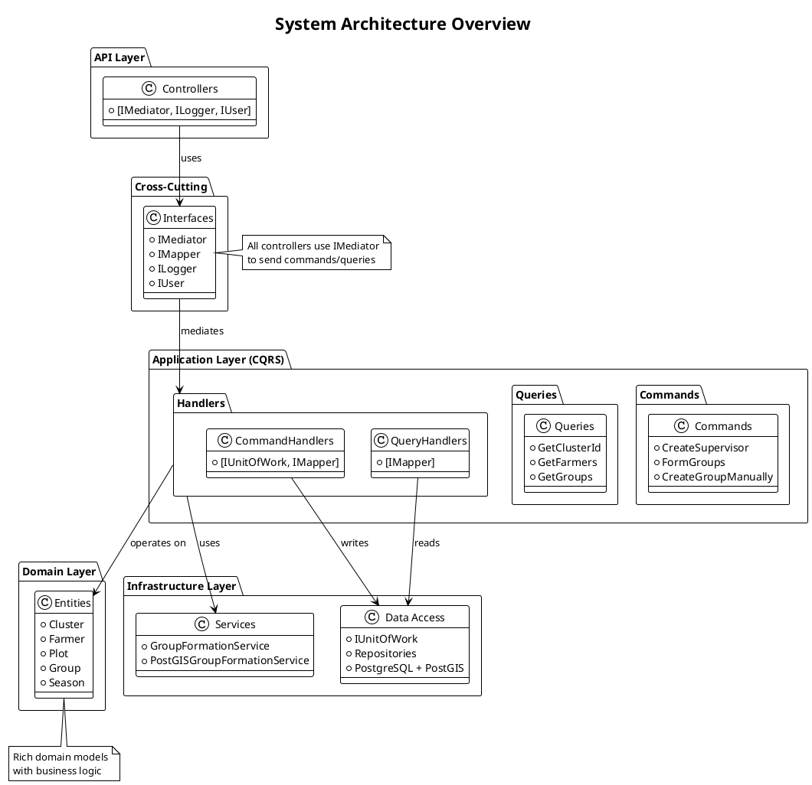
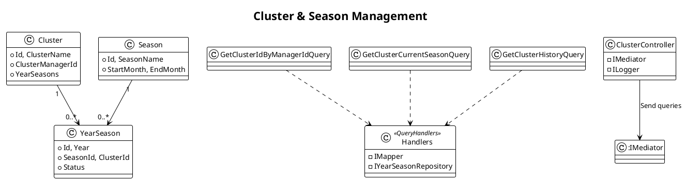
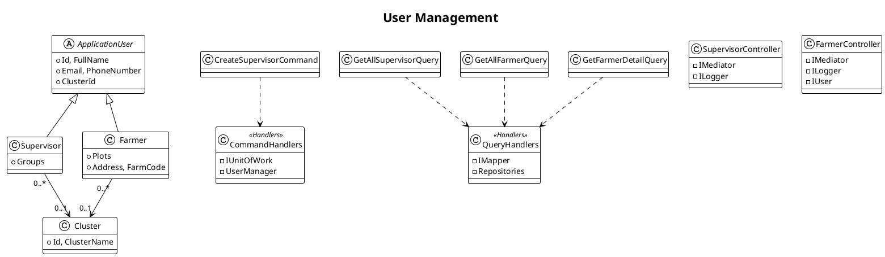
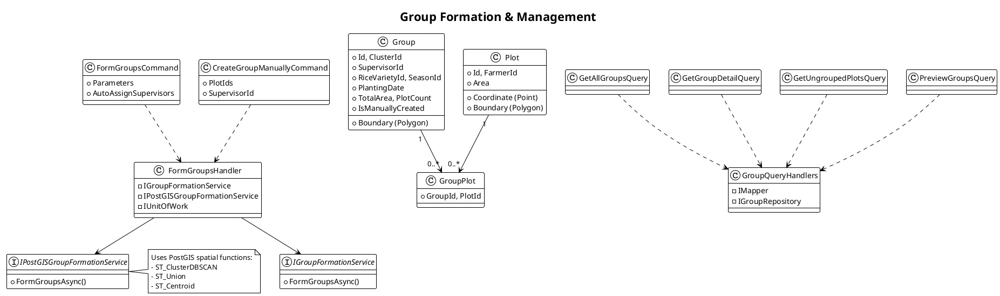
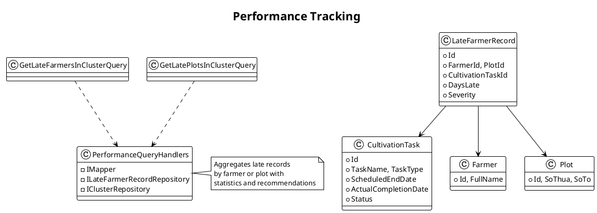
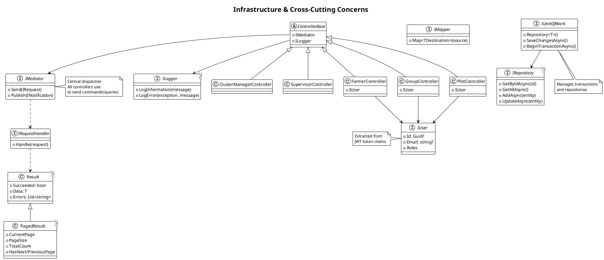
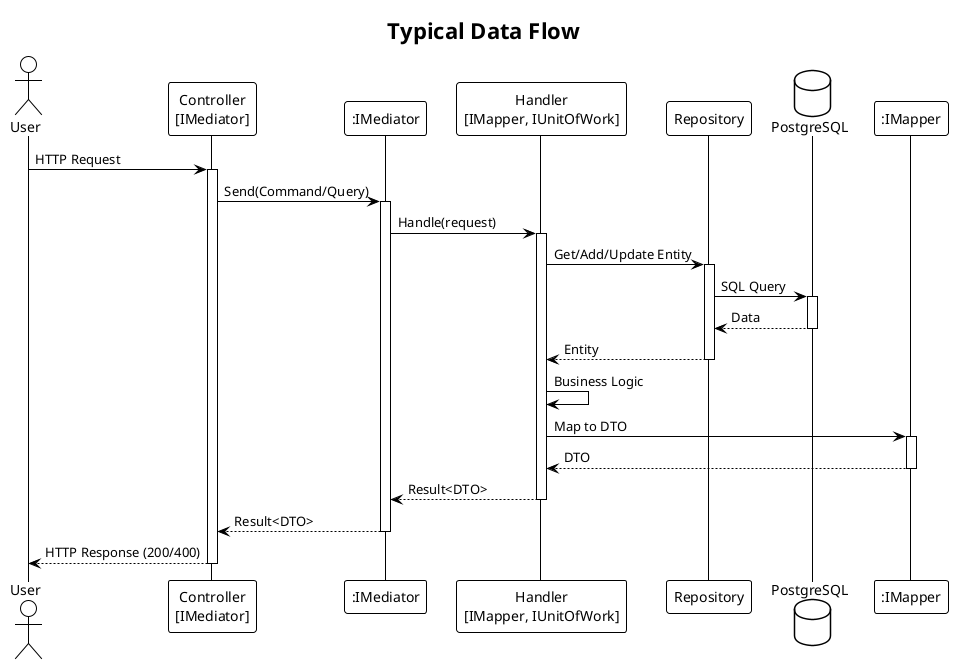

# Cluster Manager Use Cases - Class Diagrams (Concise)

## Overview

This document provides **simplified, concise** class diagrams for the Cluster Manager use cases, focusing on essential architecture and relationships without excessive implementation details.

**Architecture**: Clean Architecture with CQRS (MediatR)  
**Database**: PostgreSQL with PostGIS  
**Framework**: ASP.NET Core 8.0

### Purpose
- ✅ **High-level architecture overview**
- ✅ **Quick understanding of system structure**
- ✅ **Focus on key patterns and relationships**
- ✅ **Less clutter, more clarity**

### When to Use
- **Use this version** for presentations, documentation, and quick reference
- **Use the detailed version** (`ClusterManagerUseCases_ClassDiagrams_ByFeature.md`) for implementation details

### What's Simplified
- Removed detailed method signatures
- Combined similar classes
- Focused on key relationships only
- Removed redundant properties
- Emphasized interfaces and patterns

---

## Feature Class Specifications

This section provides detailed class specifications for each feature, organized by domain area.

---

## Feature 1: Cluster & Season Management

### Class Specification

| No | Class | Description |
|---|---|---|
| 1 | ClusterController | Controller for cluster operations, season queries, and history |
| 2 | GetClusterCurrentSeasonQuery | Query to get active season for cluster |
| 3 | GetClusterHistoryQuery | Query to get historical season data |
| 4 | GetClusterCurrentSeasonQueryHandler | Handler that gets current season with statistics (uses IMapper, IUnitOfWork) |
| 5 | Cluster | Aggregate root with manager, seasons, farmers, groups |
| 6 | YearSeason | Season instance for specific year/cluster with dates and status |
| 7 | IYearSeasonRepository | Repository for season operations and history queries |
| 8 | SeasonStatus | Enum: Planning, Active, InProgress, Harvesting, Completed, Cancelled |
| 9 | ClusterCurrentSeasonResponse | DTO with season details and statistics |
| 10 | SeasonStatistics | DTO with farmer/plot counts, area, progress |

---

## Feature 2: User Management (Supervisor & Farmer)

### Class Specification

| No | Class | Description |
|---|---|---|
| 1 | SupervisorController | Controller for supervisor creation and retrieval |
| 2 | FarmerController | Controller for farmer listing and detailed information |
| 3 | CreateSupervisorCommand | Command with name, email, phone, cluster ID to create supervisor |
| 4 | GetFarmerDetailQuery | Query with farmer ID to get complete profile |
| 5 | CreateSupervisorCommandHandler | Handler that validates, creates user with password "123456", assigns role (uses UserManager, IUnitOfWork) |
| 6 | GetFarmerDetailQueryHandler | Handler that aggregates farmer data with plots, history, metrics (uses IMapper) |
| 7 | ApplicationUser | Abstract base for all users (TPH pattern), contains ID, email, phone, cluster ID |
| 8 | Supervisor | User entity managing groups, extends ApplicationUser |
| 9 | Farmer | User entity owning plots with address and farm code |
| 10 | Plot | Entity for land plot with area and spatial data (Point, Polygon) |
| 11 | ISupervisorRepository | Repository for supervisor queries and paging |
| 12 | IFarmerRepository | Repository for farmer queries and detailed info |
| 13 | UserManager<ApplicationUser> | ASP.NET Identity service for user CRUD and roles |
| 14 | FarmerDetailDTO | DTO with farmer profile, plots, history, performance metrics |

---

## System Architecture Overview

---

## Feature 1: Cluster & Season Management

---

## Feature 2: User Management (Supervisor & Farmer)

---

## Feature 3: Group Formation & Management

### Class Specification

| No | Class | Description |
|---|---|---|
| 1 | GroupController | Controller for group formation, manual creation, queries, preview |
| 2 | FormGroupsCommand | Command with cluster, season, year, parameters, auto-assign flags |
| 3 | CreateGroupManuallyCommand | Command with supervisor, plots, variety, season, exception details |
| 4 | PreviewGroupsQuery | Query to preview groups without saving |
| 5 | GetUngroupedPlotsQuery | Query to identify ungrouped plots |
| 6 | FormGroupsCommandHandler | Handler that runs DBSCAN algorithm, creates groups, assigns supervisors (uses IGroupFormationService, IUnitOfWork) |
| 7 | FormGroupsPostGISCommandHandler | Handler using PostGIS ST_ClusterDBSCAN for large-scale clustering |
| 8 | PreviewGroupsQueryHandler | Handler that previews groups without DB changes |
| 9 | Group | Entity for cultivation group with supervisor, variety, plots, boundary (Polygon), status |
| 10 | GroupPlot | Join entity linking groups to plots |
| 11 | Plot | Entity for land plot with area, coordinate (Point), boundary (Polygon) |
| 12 | IGroupFormationService | Interface for DBSCAN spatial-temporal clustering |
| 13 | IPostGISGroupFormationService | Interface for PostGIS-based formation using ST_ClusterDBSCAN |
| 14 | IGroupRepository | Repository for group queries and nearby groups |
| 15 | GroupFormationParameters | Value object with proximity, date tolerance, area/plot limits |
| 16 | GroupFormationResult | Result with proposed groups and ungrouped plots |
| 17 | FormGroupsResponse | DTO with groups created, ungrouped count, statistics |
| 18 | UngroupedPlotsResponse | DTO with ungrouped plots, reasons, recommendations |

---

## Feature 4: Performance Tracking

### Class Specification

| No | Class | Description |
|---|---|---|
| 1 | LateFarmerRecordController | Controller for late farmer/plot records and performance tracking |
| 2 | GetLateFarmersInClusterQuery | Query to get late farmers with pagination and search |
| 3 | GetLatePlotsInClusterQuery | Query to get late plots with pagination and search |
| 4 | GetLateFarmersInClusterQueryHandler | Handler that aggregates late records by farmer with statistics (uses IMapper, IUnitOfWork) |
| 5 | GetLatePlotsInClusterQueryHandler | Handler that aggregates late records by plot with recommendations |
| 6 | LateFarmerRecord | Entity for late task with farmer, plot, task, days late, severity |
| 7 | CultivationTask | Entity for task with scheduled/actual dates, status |
| 8 | ILateFarmerRecordRepository | Repository for late records with aggregation queries |
| 9 | LateSeverity | Enum: Minor (1-3 days), Moderate (4-7), Severe (8-14), Critical (15+) |
| 10 | TaskType | Enum: LandPreparation, Seeding, Transplanting, Fertilization, Irrigation, PestControl, Harvesting |
| 11 | FarmerWithLateCountDTO | DTO with farmer info, late count, percentage, severity, recommendations |
| 12 | PlotWithLateCountDTO | DTO with plot info, late count, late tasks, recommendations |

---

---

## Feature 4: Performance Tracking

---

## Infrastructure Interfaces

### Class Specification

| No | Class | Description |
|---|---|---|
| 1 | IMediator | MediatR interface for dispatching commands/queries to handlers |
| 2 | IMapper | AutoMapper interface for entity-to-DTO mapping |
| 3 | ILogger<T> | Microsoft logging interface for structured logging |
| 4 | IUser | Interface for current user context from JWT (Id, Email, Roles) |
| 5 | IUnitOfWork | Interface managing transactions and repository access |
| 6 | IRepository<T> | Generic repository with CRUD operations |
| 7 | Result<T> | Response wrapper with Succeeded, Data, Errors, Message |
| 8 | PagedResult<T> | Pagination wrapper with page info and navigation flags |

---

---

## Key Patterns Summary

### CQRS Pattern
- **Commands**: Mutate state (Create, Update, Delete)
- **Queries**: Read data (Get, List, Search)
- **Handlers**: One handler per command/query
- **Mediator**: Dispatches requests to handlers

### Repository Pattern
- Generic `IRepository<T>` for common operations
- Specialized repositories for complex queries
- `IUnitOfWork` manages transactions

### Result Pattern
- `Result<T>` wraps all handler responses
- `PagedResult<T>` for paginated queries
- Consistent error handling

### Dependency Injection
All interfaces injected via constructor:
- Controllers: `IMediator`, `ILogger`, `IUser`
- Command Handlers: `IUnitOfWork`, `IMapper`
- Query Handlers: `IMapper`, Repositories

### PostGIS Integration
- Spatial clustering: `ST_ClusterDBSCAN`
- Distance calculations: `ST_Distance`
- Geometry operations: `ST_Union`, `ST_Centroid`

---

## Data Flow

---

## Summary

This document provides **concise class specifications** and **simplified class diagrams** for all Cluster Manager use cases.

### Class Specifications by Feature:
- **Feature 1: Cluster & Season Management** - 10 key classes
- **Feature 2: User Management (Supervisor & Farmer)** - 14 key classes  
- **Feature 3: Group Formation & Management** - 18 key classes
- **Feature 4: Performance Tracking** - 12 key classes
- **Infrastructure Interfaces** - 8 core interfaces

**Total: 62 essential classes** with concise descriptions

### What's Included:
- ✅ Controllers and their dependencies
- ✅ Key Commands and Queries
- ✅ Main Handlers with interface dependencies
- ✅ Core Domain Entities
- ✅ Essential Services and Repositories
- ✅ Important DTOs and Value Objects
- ✅ Critical Enumerations

### What's Excluded (for brevity):
- ❌ All query variations (only showing representative ones)
- ❌ Duplicate DTOs across features
- ❌ Minor helper classes
- ❌ Detailed repository methods

### Architecture Patterns:
- ✅ Clean Architecture (API → Application → Domain → Infrastructure)
- ✅ CQRS Pattern with MediatR
- ✅ Repository Pattern with Unit of Work
- ✅ Result Pattern for consistent responses
- ✅ Dependency Injection for all cross-cutting concerns

### Key Technologies:
- ASP.NET Core 8.0
- Entity Framework Core
- PostgreSQL with PostGIS
- MediatR (CQRS)
- AutoMapper
- ASP.NET Identity
- JWT Authentication

---

*Generated for SRPW-AI-BE Project*  
*Concise Class Diagrams with Detailed Specifications*  
*Last Updated: December 15, 2025*

