# Cluster Manager Use Cases - Sequence Diagrams

## Project Overview: SRPW-AI-BE (Smart Rice Production Workflow - AI Backend)

**Architecture**: Clean Architecture with CQRS Pattern (MediatR)  
**Database**: PostgreSQL with PostGIS for spatial data  
**Framework**: ASP.NET Core 8.0  
**Key Technologies**: Entity Framework Core, PostGIS, JWT Authentication

### System Layers:
1. **API**: Controllers expose RESTful endpoints
2. **Application**: Commands/Queries handlers with business logic  
3. **Domain**: Entities, value objects, domain events
4. **Infrastructure**: Data access, external services, PostGIS operations

### Reading Sequence Diagrams:

**Participant Notation:**
- `Controller [IMediator, ILogger]` - Shows injected interfaces
- `Handler [IMapper, IUnitOfWork]` - Shows handler dependencies
- `:IMediator` - Interface participant (shown with colon prefix)

**Message Flow:**
```
Controller -> :IMediator : Send(Command/Query)
:IMediator -> Handler : Handle(request)
Handler -> :IMapper : Map<DTO>(entity)
Handler -> IUnitOfWork : SaveChangesAsync()
```

All controllers use **IMediator** to dispatch commands/queries to their respective handlers. Handlers use **IMapper** for DTO transformation and **IUnitOfWork** for database operations.

---

## UC-CM01: Get Cluster ID By Manager ID

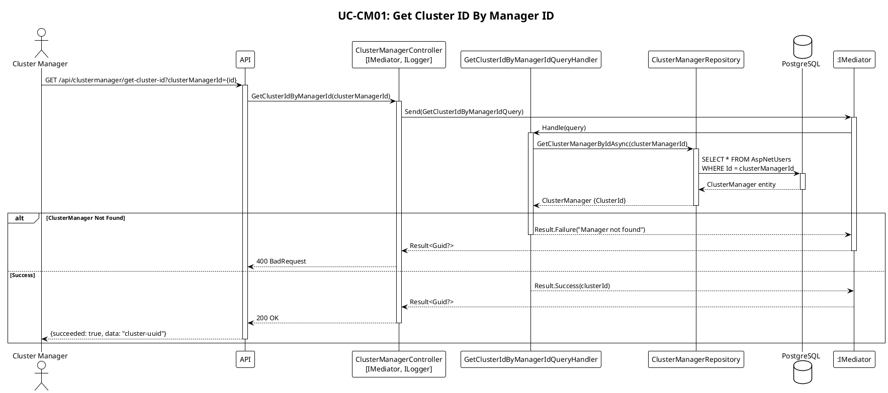
```plantuml
@startuml GetClusterIdByManagerId
!theme plain
title UC-CM01: Get Cluster ID By Manager ID

actor "Cluster Manager" as CM
participant "API" as API
participant "ClusterManagerController\n[IMediator, ILogger]" as Controller
participant GetClusterIdByManagerIdQueryHandler as Handler
participant ClusterManagerRepository as Repo
database PostgreSQL as DB

CM -> API: GET /api/clustermanager/get-cluster-id?clusterManagerId={id}
activate API
API -> Controller: GetClusterIdByManagerId(clusterManagerId)
activate Controller

Controller -> ":IMediator": Send(GetClusterIdByManagerIdQuery)
activate ":IMediator"
":IMediator" -> Handler: Handle(query)
activate Handler

Handler -> Repo: GetClusterManagerByIdAsync(clusterManagerId)
activate Repo
Repo -> DB: SELECT * FROM AspNetUsers\nWHERE Id = clusterManagerId
activate DB
DB --> Repo: ClusterManager entity
deactivate DB
Repo --> Handler: ClusterManager {ClusterId}
deactivate Repo

alt ClusterManager Not Found
    Handler --> ":IMediator": Result.Failure("Manager not found")
    deactivate Handler
    ":IMediator" --> Controller: Result<Guid?>
    deactivate ":IMediator"
    Controller --> API: 400 BadRequest
else Success
    Handler --> ":IMediator": Result.Success(clusterId)
    deactivate Handler
    ":IMediator" --> Controller: Result<Guid?>
    deactivate ":IMediator"
    Controller --> API: 200 OK
    deactivate Controller
    API --> CM: {succeeded: true, data: "cluster-uuid"}
    deactivate API
end

@enduml
```

---

## UC-CM02: Create Supervisor

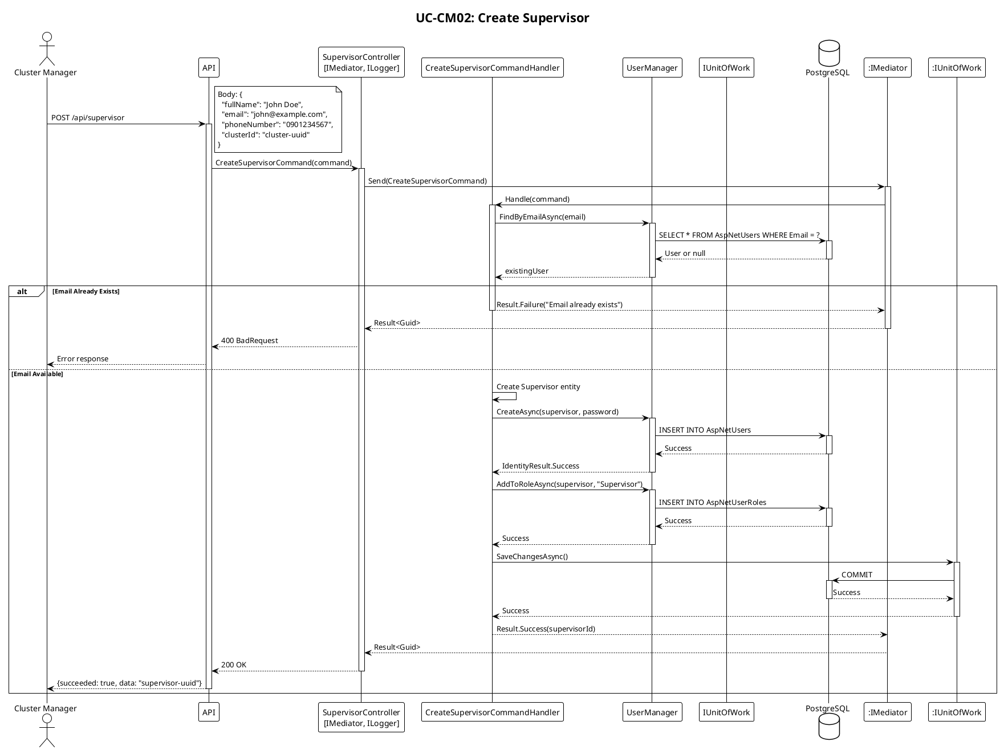
```plantuml
@startuml CreateSupervisor
!theme plain
title UC-CM02: Create Supervisor

actor "Cluster Manager" as CM
participant API
participant "SupervisorController\n[IMediator, ILogger]" as Controller
participant CreateSupervisorCommandHandler as Handler
participant UserManager
participant "IUnitOfWork" as UOW
database "PostgreSQL" as DB

CM -> API: POST /api/supervisor
note right
Body: {
  "fullName": "John Doe",
  "email": "john@example.com",
  "phoneNumber": "0901234567",
  "clusterId": "cluster-uuid"
}
end note
activate API

API -> Controller: CreateSupervisorCommand(command)
activate Controller
Controller -> ":IMediator": Send(CreateSupervisorCommand)
activate ":IMediator"
":IMediator" -> Handler: Handle(command)
activate Handler

Handler -> UserManager: FindByEmailAsync(email)
activate UserManager
UserManager -> DB: SELECT * FROM AspNetUsers WHERE Email = ?
activate DB
DB --> UserManager: User or null
deactivate DB
UserManager --> Handler: existingUser
deactivate UserManager

alt Email Already Exists
    Handler --> ":IMediator": Result.Failure("Email already exists")
    deactivate Handler
    ":IMediator" --> Controller: Result<Guid>
    deactivate ":IMediator"
    Controller --> API: 400 BadRequest
    API --> CM: Error response
else Email Available
    Handler -> Handler: Create Supervisor entity
    
    Handler -> UserManager: CreateAsync(supervisor, password)
    activate UserManager
    UserManager -> DB: INSERT INTO AspNetUsers
    activate DB
    DB --> UserManager: Success
    deactivate DB
    UserManager --> Handler: IdentityResult.Success
    deactivate UserManager
    
    Handler -> UserManager: AddToRoleAsync(supervisor, "Supervisor")
    activate UserManager
    UserManager -> DB: INSERT INTO AspNetUserRoles
    activate DB
    DB --> UserManager: Success
    deactivate DB
    UserManager --> Handler: Success
    deactivate UserManager
    
    Handler -> ":IUnitOfWork": SaveChangesAsync()
    activate ":IUnitOfWork"
    ":IUnitOfWork" -> DB: COMMIT
    activate DB
    DB --> ":IUnitOfWork": Success
    deactivate DB
    ":IUnitOfWork" --> Handler: Success
    deactivate ":IUnitOfWork"
    
    Handler --> ":IMediator": Result.Success(supervisorId)
    deactivate Handler
    ":IMediator" --> Controller: Result<Guid>
    deactivate ":IMediator"
    Controller --> API: 200 OK
    deactivate Controller
    API --> CM: {succeeded: true, data: "supervisor-uuid"}
    deactivate API
end

@enduml
```

---

## UC-CM03: Get All Supervisors

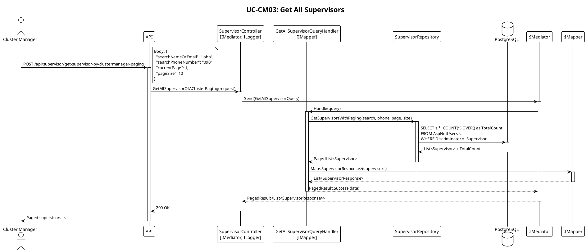
```plantuml
@startuml GetAllSupervisors
!theme plain
title UC-CM03: Get All Supervisors

actor "Cluster Manager" as CM
participant API
participant "SupervisorController\n[IMediator, ILogger]" as SupervisorController
participant "GetAllSupervisorQueryHandler\n[IMapper]" as Handler
participant SupervisorRepository as Repo
database PostgreSQL as DB

CM -> API: POST /api/supervisor/get-supervisor-by-clustermanager-paging
note right
Body: {
  "searchNameOrEmail": "john",
  "searchPhoneNumber": "090",
  "currentPage": 1,
  "pageSize": 10
}
end note

activate API
API -> SupervisorController: GetAllSupervisorOfAClusterPaging(request)
activate SupervisorController

SupervisorController -> ":IMediator": Send(GetAllSupervisorQuery)
activate ":IMediator"
":IMediator" -> Handler: Handle(query)
activate Handler

Handler -> Repo: GetSupervisorsWithPaging(search, phone, page, size)
activate Repo
Repo -> DB: SELECT s.*, COUNT(*) OVER() as TotalCount\nFROM AspNetUsers s\nWHERE Discriminator = 'Supervisor'...
activate DB
DB --> Repo: List<Supervisor> + TotalCount
deactivate DB
Repo --> Handler: PagedList<Supervisor>
deactivate Repo

Handler -> ":IMapper": Map<SupervisorResponse>(supervisors)
activate ":IMapper"
":IMapper" --> Handler: List<SupervisorResponse>
deactivate ":IMapper"

Handler --> ":IMediator": PagedResult.Success(data)
deactivate Handler
":IMediator" --> SupervisorController: PagedResult<List<SupervisorResponse>>
deactivate ":IMediator"
SupervisorController --> API: 200 OK
deactivate SupervisorController
API --> CM: Paged supervisors list
deactivate API

@enduml
```

---

## UC-CM04: Get All Farmers

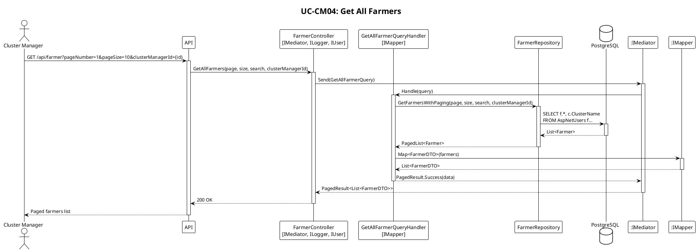
```plantuml
@startuml GetAllFarmers
!theme plain
title UC-CM04: Get All Farmers

actor "Cluster Manager" as CM
participant API
participant "FarmerController\n[IMediator, ILogger, IUser]" as FarmerController
participant "GetAllFarmerQueryHandler\n[IMapper]" as Handler
participant FarmerRepository as Repo
database PostgreSQL as DB

CM -> API: GET /api/farmer?pageNumber=1&pageSize=10&clusterManagerId={id}
activate API

API -> FarmerController: GetAllFarmers(page, size, search, clusterManagerId)
activate FarmerController

FarmerController -> ":IMediator": Send(GetAllFarmerQuery)
activate ":IMediator"
":IMediator" -> Handler: Handle(query)
activate Handler

Handler -> Repo: GetFarmersWithPaging(page, size, search, clusterManagerId)
activate Repo
Repo -> DB: SELECT f.*, c.ClusterName\nFROM AspNetUsers f...
activate DB
DB --> Repo: List<Farmer>
deactivate DB
Repo --> Handler: PagedList<Farmer>
deactivate Repo

Handler -> ":IMapper": Map<FarmerDTO>(farmers)
activate ":IMapper"
":IMapper" --> Handler: List<FarmerDTO>
deactivate ":IMapper"

Handler --> ":IMediator": PagedResult.Success(data)
deactivate Handler
":IMediator" --> FarmerController: PagedResult<List<FarmerDTO>>
deactivate ":IMediator"
FarmerController --> API: 200 OK
deactivate FarmerController
API --> CM: Paged farmers list
deactivate API

@enduml
```

---

## UC-CM05: Get Farmer Detail

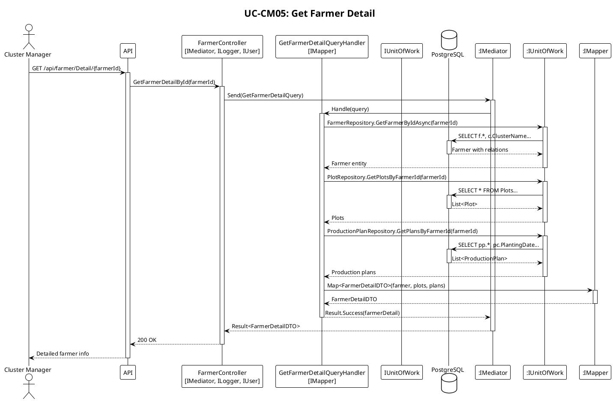
```plantuml
@startuml GetFarmerDetail
!theme plain
title UC-CM05: Get Farmer Detail

actor "Cluster Manager" as CM
participant API
participant "FarmerController\n[IMediator, ILogger, IUser]" as FarmerController
participant "GetFarmerDetailQueryHandler\n[IMapper]" as Handler
participant "IUnitOfWork" as UOW
database PostgreSQL as DB

CM -> API: GET /api/farmer/Detail/{farmerId}
activate API

API -> FarmerController: GetFarmerDetailById(farmerId)
activate FarmerController

FarmerController -> ":IMediator": Send(GetFarmerDetailQuery)
activate ":IMediator"
":IMediator" -> Handler: Handle(query)
activate Handler

Handler -> ":IUnitOfWork": FarmerRepository.GetFarmerByIdAsync(farmerId)
activate ":IUnitOfWork"
":IUnitOfWork" -> DB: SELECT f.*, c.ClusterName...
activate DB
DB --> ":IUnitOfWork": Farmer with relations
deactivate DB
":IUnitOfWork" --> Handler: Farmer entity
deactivate ":IUnitOfWork"

Handler -> ":IUnitOfWork": PlotRepository.GetPlotsByFarmerId(farmerId)
activate ":IUnitOfWork"
":IUnitOfWork" -> DB: SELECT * FROM Plots...
activate DB
DB --> ":IUnitOfWork": List<Plot>
deactivate DB
":IUnitOfWork" --> Handler: Plots
deactivate ":IUnitOfWork"

Handler -> ":IUnitOfWork": ProductionPlanRepository.GetPlansByFarmerId(farmerId)
activate ":IUnitOfWork"
":IUnitOfWork" -> DB: SELECT pp.*, pc.PlantingDate...
activate DB
DB --> ":IUnitOfWork": List<ProductionPlan>
deactivate DB
":IUnitOfWork" --> Handler: Production plans
deactivate ":IUnitOfWork"

Handler -> ":IMapper": Map<FarmerDetailDTO>(farmer, plots, plans)
activate ":IMapper"
":IMapper" --> Handler: FarmerDetailDTO
deactivate ":IMapper"

Handler --> ":IMediator": Result.Success(farmerDetail)
deactivate Handler
":IMediator" --> FarmerController: Result<FarmerDetailDTO>
deactivate ":IMediator"
FarmerController --> API: 200 OK
deactivate FarmerController
API --> CM: Detailed farmer info
deactivate API

@enduml
```

---

## UC-CM06: Get Cluster Available Seasons

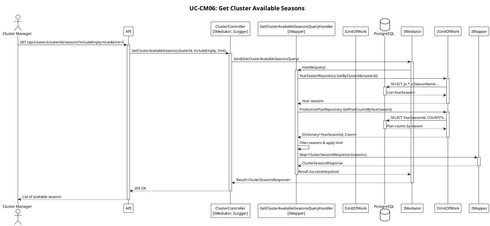
```plantuml
@startuml GetClusterAvailableSeasons
!theme plain
title UC-CM06: Get Cluster Available Seasons

actor "Cluster Manager" as CM
participant API
participant "ClusterController\n[IMediator, ILogger]" as ClusterController
participant "GetClusterAvailableSeasonsQueryHandler\n[IMapper]" as Handler
participant "IUnitOfWork" as UOW
database PostgreSQL as DB

CM -> API: GET /api/cluster/{clusterId}/seasons?includeEmpty=true&limit=5
activate API

API -> ClusterController: GetClusterAvailableSeasons(clusterId, includeEmpty, limit)
activate ClusterController

ClusterController -> ":IMediator": Send(GetClusterAvailableSeasonsQuery)
activate ":IMediator"
":IMediator" -> Handler: Handle(query)
activate Handler

Handler -> ":IUnitOfWork": YearSeasonRepository.GetByClusterId(clusterId)
activate ":IUnitOfWork"
":IUnitOfWork" -> DB: SELECT ys.*, s.SeasonName...
activate DB
DB --> ":IUnitOfWork": List<YearSeason>
deactivate DB
":IUnitOfWork" --> Handler: Year seasons
deactivate ":IUnitOfWork"

Handler -> ":IUnitOfWork": ProductionPlanRepository.GetPlanCountsByYearSeason()
activate ":IUnitOfWork"
":IUnitOfWork" -> DB: SELECT YearSeasonId, COUNT(*)...
activate DB
DB --> ":IUnitOfWork": Plan counts by season
deactivate DB
":IUnitOfWork" --> Handler: Dictionary<YearSeasonId, Count>
deactivate ":IUnitOfWork"

Handler -> Handler: Filter seasons & apply limit

Handler -> ":IMapper": Map<ClusterSeasonsResponse>(seasons)
activate ":IMapper"
":IMapper" --> Handler: ClusterSeasonsResponse
deactivate ":IMapper"

Handler --> ":IMediator": Result.Success(response)
deactivate Handler
":IMediator" --> ClusterController: Result<ClusterSeasonsResponse>
deactivate ":IMediator"
ClusterController --> API: 200 OK
deactivate ClusterController
API --> CM: List of available seasons
deactivate API

@enduml
```

---

## UC-CM07: Get Cluster Current Season

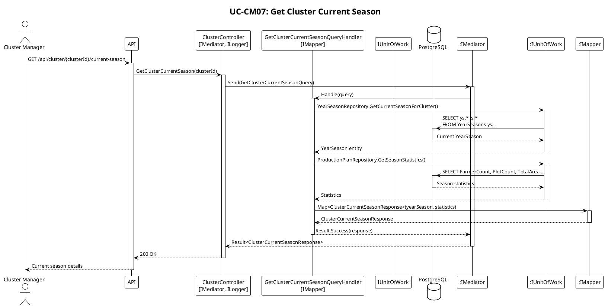
```plantuml
@startuml GetClusterCurrentSeason
!theme plain
title UC-CM07: Get Cluster Current Season

actor "Cluster Manager" as CM
participant API
participant "ClusterController\n[IMediator, ILogger]" as ClusterController
participant "GetClusterCurrentSeasonQueryHandler\n[IMapper]" as Handler
participant "IUnitOfWork" as UOW
database PostgreSQL as DB

CM -> API: GET /api/cluster/{clusterId}/current-season
activate API

API -> ClusterController: GetClusterCurrentSeason(clusterId)
activate ClusterController

ClusterController -> ":IMediator": Send(GetClusterCurrentSeasonQuery)
activate ":IMediator"
":IMediator" -> Handler: Handle(query)
activate Handler

Handler -> ":IUnitOfWork": YearSeasonRepository.GetCurrentSeasonForCluster()
activate ":IUnitOfWork"
":IUnitOfWork" -> DB: SELECT ys.*, s.*\nFROM YearSeasons ys...
activate DB
DB --> ":IUnitOfWork": Current YearSeason
deactivate DB
":IUnitOfWork" --> Handler: YearSeason entity
deactivate ":IUnitOfWork"

Handler -> ":IUnitOfWork": ProductionPlanRepository.GetSeasonStatistics()
activate ":IUnitOfWork"
":IUnitOfWork" -> DB: SELECT FarmerCount, PlotCount, TotalArea...
activate DB
DB --> ":IUnitOfWork": Season statistics
deactivate DB
":IUnitOfWork" --> Handler: Statistics
deactivate ":IUnitOfWork"

Handler -> ":IMapper": Map<ClusterCurrentSeasonResponse>(yearSeason, statistics)
activate ":IMapper"
":IMapper" --> Handler: ClusterCurrentSeasonResponse
deactivate ":IMapper"

Handler --> ":IMediator": Result.Success(response)
deactivate Handler
":IMediator" --> ClusterController: Result<ClusterCurrentSeasonResponse>
deactivate ":IMediator"
ClusterController --> API: 200 OK
deactivate ClusterController
API --> CM: Current season details
deactivate API

@enduml
```

---

## UC-CM08: Get Cluster History

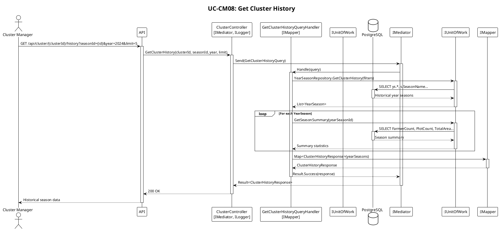
```plantuml
    @startuml GetClusterHistory
    !theme plain
    title UC-CM08: Get Cluster History

    actor "Cluster Manager" as CM
    participant API
    participant "ClusterController\n[IMediator, ILogger]" as ClusterController
    participant "GetClusterHistoryQueryHandler\n[IMapper]" as Handler
    participant "IUnitOfWork" as UOW
    database PostgreSQL as DB

    CM -> API: GET /api/cluster/{clusterId}/history?seasonId={id}&year=2024&limit=5
    activate API

    API -> ClusterController: GetClusterHistory(clusterId, seasonId, year, limit)
    activate ClusterController

    ClusterController -> ":IMediator": Send(GetClusterHistoryQuery)
    activate ":IMediator"
    ":IMediator" -> Handler: Handle(query)
    activate Handler

    Handler -> ":IUnitOfWork": YearSeasonRepository.GetClusterHistory(filters)
    activate ":IUnitOfWork"
    ":IUnitOfWork" -> DB: SELECT ys.*, s.SeasonName...
    activate DB
    DB --> ":IUnitOfWork": Historical year seasons
    deactivate DB
    ":IUnitOfWork" --> Handler: List<YearSeason>
    deactivate ":IUnitOfWork"

    loop For each YearSeason
        Handler -> ":IUnitOfWork": GetSeasonSummary(yearSeasonId)
        activate ":IUnitOfWork"
        ":IUnitOfWork" -> DB: SELECT FarmerCount, PlotCount, TotalArea...
        activate DB
        DB --> ":IUnitOfWork": Season summary
        deactivate DB
        ":IUnitOfWork" --> Handler: Summary statistics
        deactivate ":IUnitOfWork"
    end

    Handler -> ":IMapper": Map<ClusterHistoryResponse>(yearSeasons)
    activate ":IMapper"
    ":IMapper" --> Handler: ClusterHistoryResponse
    deactivate ":IMapper"

    Handler --> ":IMediator": Result.Success(response)
    deactivate Handler
    ":IMediator" --> ClusterController: Result<ClusterHistoryResponse>
    deactivate ":IMediator"
    ClusterController --> API: 200 OK
    deactivate ClusterController
    API --> CM: Historical season data
    deactivate API

    @enduml
```

---

## UC-CM09: Get Year Seasons By Cluster

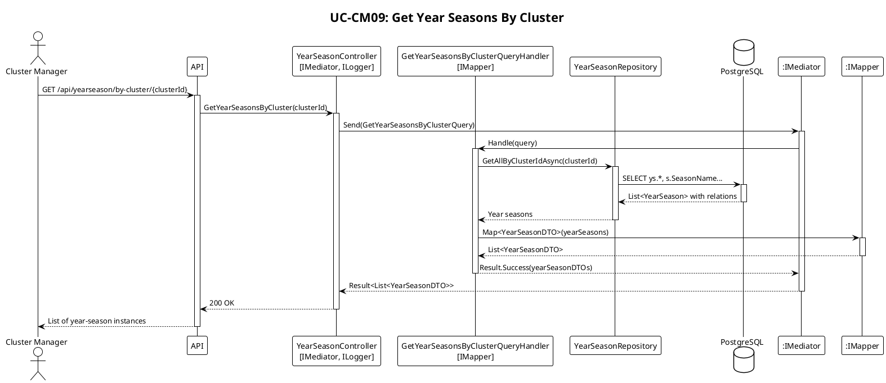
```plantuml
@startuml GetYearSeasonsByCluster
!theme plain
title UC-CM09: Get Year Seasons By Cluster

actor "Cluster Manager" as CM
participant API
participant "YearSeasonController\n[IMediator, ILogger]" as YearSeasonController
participant "GetYearSeasonsByClusterQueryHandler\n[IMapper]" as Handler
participant YearSeasonRepository as Repo
database PostgreSQL as DB

CM -> API: GET /api/yearseason/by-cluster/{clusterId}
activate API

API -> YearSeasonController: GetYearSeasonsByCluster(clusterId)
activate YearSeasonController

YearSeasonController -> ":IMediator": Send(GetYearSeasonsByClusterQuery)
activate ":IMediator"
":IMediator" -> Handler: Handle(query)
activate Handler

Handler -> Repo: GetAllByClusterIdAsync(clusterId)
activate Repo
Repo -> DB: SELECT ys.*, s.SeasonName...
activate DB
DB --> Repo: List<YearSeason> with relations
deactivate DB
Repo --> Handler: Year seasons
deactivate Repo

Handler -> ":IMapper": Map<YearSeasonDTO>(yearSeasons)
activate ":IMapper"
":IMapper" --> Handler: List<YearSeasonDTO>
deactivate ":IMapper"

Handler --> ":IMediator": Result.Success(yearSeasonDTOs)
deactivate Handler
":IMediator" --> YearSeasonController: Result<List<YearSeasonDTO>>
deactivate ":IMediator"
YearSeasonController --> API: 200 OK
deactivate YearSeasonController
API --> CM: List of year-season instances
deactivate API

@enduml
```

---

## UC-CM10: Form Groups (Automatic)

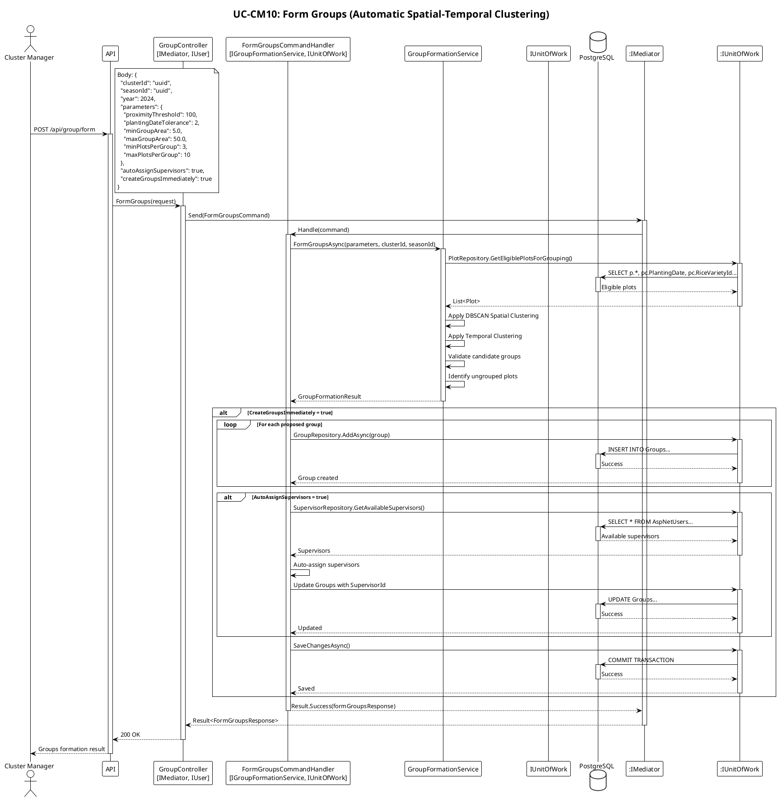
```plantuml
@startuml FormGroups
!theme plain
title UC-CM10: Form Groups (Automatic Spatial-Temporal Clustering)

actor "Cluster Manager" as CM
participant API
participant "GroupController\n[IMediator, IUser]" as GroupController
participant "FormGroupsCommandHandler\n[IGroupFormationService, IUnitOfWork]" as Handler
participant GroupFormationService as Service
participant "IUnitOfWork" as UOW
database PostgreSQL as DB

CM -> API: POST /api/group/form
note right
Body: {
  "clusterId": "uuid",
  "seasonId": "uuid",
  "year": 2024,
  "parameters": {
    "proximityThreshold": 100,
    "plantingDateTolerance": 2,
    "minGroupArea": 5.0,
    "maxGroupArea": 50.0,
    "minPlotsPerGroup": 3,
    "maxPlotsPerGroup": 10
  },
  "autoAssignSupervisors": true,
  "createGroupsImmediately": true
}
end note
activate API

API -> GroupController: FormGroups(request)
activate GroupController

GroupController -> ":IMediator": Send(FormGroupsCommand)
activate ":IMediator"
":IMediator" -> Handler: Handle(command)
activate Handler

Handler -> Service: FormGroupsAsync(parameters, clusterId, seasonId)
activate Service

Service -> ":IUnitOfWork": PlotRepository.GetEligiblePlotsForGrouping()
activate ":IUnitOfWork"
":IUnitOfWork" -> DB: SELECT p.*, pc.PlantingDate, pc.RiceVarietyId...
activate DB
DB --> ":IUnitOfWork": Eligible plots
deactivate DB
":IUnitOfWork" --> Service: List<Plot>
deactivate ":IUnitOfWork"

Service -> Service: Apply DBSCAN Spatial Clustering

Service -> Service: Apply Temporal Clustering

Service -> Service: Validate candidate groups

Service -> Service: Identify ungrouped plots

Service --> Handler: GroupFormationResult
deactivate Service

alt CreateGroupsImmediately = true
    loop For each proposed group
        Handler -> ":IUnitOfWork": GroupRepository.AddAsync(group)
        activate ":IUnitOfWork"
        ":IUnitOfWork" -> DB: INSERT INTO Groups...
        activate DB
        DB --> ":IUnitOfWork": Success
        deactivate DB
        ":IUnitOfWork" --> Handler: Group created
        deactivate ":IUnitOfWork"
    end
    
    alt AutoAssignSupervisors = true
        Handler -> ":IUnitOfWork": SupervisorRepository.GetAvailableSupervisors()
        activate ":IUnitOfWork"
        ":IUnitOfWork" -> DB: SELECT * FROM AspNetUsers...
        activate DB
        DB --> ":IUnitOfWork": Available supervisors
        deactivate DB
        ":IUnitOfWork" --> Handler: Supervisors
        deactivate ":IUnitOfWork"
        
        Handler -> Handler: Auto-assign supervisors
        
        Handler -> ":IUnitOfWork": Update Groups with SupervisorId
        activate ":IUnitOfWork"
        ":IUnitOfWork" -> DB: UPDATE Groups...
        activate DB
        DB --> ":IUnitOfWork": Success
        deactivate DB
        ":IUnitOfWork" --> Handler: Updated
        deactivate ":IUnitOfWork"
    end
    
    Handler -> ":IUnitOfWork": SaveChangesAsync()
    activate ":IUnitOfWork"
    ":IUnitOfWork" -> DB: COMMIT TRANSACTION
    activate DB
    DB --> ":IUnitOfWork": Success
    deactivate DB
    ":IUnitOfWork" --> Handler: Saved
    deactivate ":IUnitOfWork"
end

Handler --> ":IMediator": Result.Success(formGroupsResponse)
deactivate Handler
":IMediator" --> GroupController: Result<FormGroupsResponse>
deactivate ":IMediator"
GroupController --> API: 200 OK
deactivate GroupController
API --> CM: Groups formation result
deactivate API

@enduml
```

---

## UC-CM11: Form Groups PostGIS

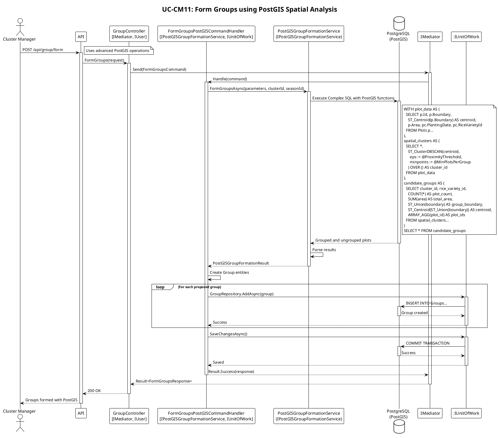
```plantuml
@startuml FormGroupsPostGIS
!theme plain
title UC-CM11: Form Groups using PostGIS Spatial Analysis

actor "Cluster Manager" as CM
participant API
participant "GroupController\n[IMediator, IUser]" as GroupController
participant "FormGroupsPostGISCommandHandler\n[IPostGISGroupFormationService, IUnitOfWork]" as Handler
participant "PostGISGroupFormationService\n(IPostGISGroupFormationService)" as PostGIS
database "PostgreSQL\n(PostGIS)" as DB

CM -> API: POST /api/group/form
note right: Uses advanced PostGIS operations
activate API

API -> GroupController: FormGroups(request)
activate GroupController

GroupController -> ":IMediator": Send(FormGroupsCommand)
activate ":IMediator"
":IMediator" -> Handler: Handle(command)
activate Handler

Handler -> PostGIS: FormGroupsAsync(parameters, clusterId, seasonId)
activate PostGIS

PostGIS -> DB: Execute Complex SQL with PostGIS functions
activate DB
note right of DB
WITH plot_data AS (
  SELECT p.Id, p.Boundary, 
    ST_Centroid(p.Boundary) AS centroid,
    p.Area, pc.PlantingDate, pc.RiceVarietyId
  FROM Plots p...
),
spatial_clusters AS (
  SELECT *,
    ST_ClusterDBSCAN(centroid,
      eps := @ProximityThreshold,
      minpoints := @MinPlotsPerGroup
    ) OVER () AS cluster_id
  FROM plot_data
),
candidate_groups AS (
  SELECT cluster_id, rice_variety_id,
    COUNT(*) AS plot_count,
    SUM(area) AS total_area,
    ST_Union(boundary) AS group_boundary,
    ST_Centroid(ST_Union(boundary)) AS centroid,
    ARRAY_AGG(plot_id) AS plot_ids
  FROM spatial_clusters...
)
SELECT * FROM candidate_groups
end note
DB --> PostGIS: Grouped and ungrouped plots
deactivate DB

PostGIS -> PostGIS: Parse results

PostGIS --> Handler: PostGISGroupFormationResult
deactivate PostGIS

Handler -> Handler: Create Group entities

loop For each proposed group
    Handler -> ":IUnitOfWork": GroupRepository.AddAsync(group)
    activate ":IUnitOfWork"
    ":IUnitOfWork" -> DB: INSERT INTO Groups...
    activate DB
    DB --> ":IUnitOfWork": Group created
    deactivate DB
    ":IUnitOfWork" --> Handler: Success
    deactivate ":IUnitOfWork"
end

Handler -> ":IUnitOfWork": SaveChangesAsync()
activate ":IUnitOfWork"
":IUnitOfWork" -> DB: COMMIT TRANSACTION
activate DB
DB --> ":IUnitOfWork": Success
deactivate DB
":IUnitOfWork" --> Handler: Saved
deactivate ":IUnitOfWork"

Handler --> ":IMediator": Result.Success(response)
deactivate Handler
":IMediator" --> GroupController: Result<FormGroupsResponse>
deactivate ":IMediator"
GroupController --> API: 200 OK
deactivate GroupController
API --> CM: Groups formed with PostGIS
deactivate API

@enduml
```

---

## UC-CM12: Create Group Manually

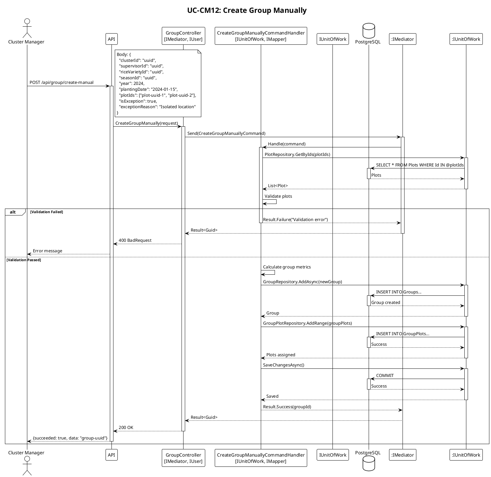
```plantuml
@startuml CreateGroupManually
!theme plain
title UC-CM12: Create Group Manually

actor "Cluster Manager" as CM
participant API
participant "GroupController\n[IMediator, IUser]" as GroupController
participant "CreateGroupManuallyCommandHandler\n[IUnitOfWork, IMapper]" as Handler
participant "IUnitOfWork" as UOW
database PostgreSQL as DB

CM -> API: POST /api/group/create-manual
note right
Body: {
  "clusterId": "uuid",
  "supervisorId": "uuid",
  "riceVarietyId": "uuid",
  "seasonId": "uuid",
  "year": 2024,
  "plantingDate": "2024-01-15",
  "plotIds": ["plot-uuid-1", "plot-uuid-2"],
  "isException": true,
  "exceptionReason": "Isolated location"
}
end note
activate API

API -> GroupController: CreateGroupManually(request)
activate GroupController

GroupController -> ":IMediator": Send(CreateGroupManuallyCommand)
activate ":IMediator"
":IMediator" -> Handler: Handle(command)
activate Handler

Handler -> ":IUnitOfWork": PlotRepository.GetByIds(plotIds)
activate ":IUnitOfWork"
":IUnitOfWork" -> DB: SELECT * FROM Plots WHERE Id IN @plotIds
activate DB
DB --> ":IUnitOfWork": Plots
deactivate DB
":IUnitOfWork" --> Handler: List<Plot>
deactivate ":IUnitOfWork"

Handler -> Handler: Validate plots

alt Validation Failed
    Handler --> ":IMediator": Result.Failure("Validation error")
    deactivate Handler
    ":IMediator" --> GroupController: Result<Guid>
    deactivate ":IMediator"
    GroupController --> API: 400 BadRequest
    API --> CM: Error message
else Validation Passed
    Handler -> Handler: Calculate group metrics
    
    Handler -> ":IUnitOfWork": GroupRepository.AddAsync(newGroup)
    activate ":IUnitOfWork"
    ":IUnitOfWork" -> DB: INSERT INTO Groups...
    activate DB
    DB --> ":IUnitOfWork": Group created
    deactivate DB
    ":IUnitOfWork" --> Handler: Group
    deactivate ":IUnitOfWork"
    
    Handler -> ":IUnitOfWork": GroupPlotRepository.AddRange(groupPlots)
    activate ":IUnitOfWork"
    ":IUnitOfWork" -> DB: INSERT INTO GroupPlots...
    activate DB
    DB --> ":IUnitOfWork": Success
    deactivate DB
    ":IUnitOfWork" --> Handler: Plots assigned
    deactivate ":IUnitOfWork"
    
    Handler -> ":IUnitOfWork": SaveChangesAsync()
    activate ":IUnitOfWork"
    ":IUnitOfWork" -> DB: COMMIT
    activate DB
    DB --> ":IUnitOfWork": Success
    deactivate DB
    ":IUnitOfWork" --> Handler: Saved
    deactivate ":IUnitOfWork"
    
    Handler --> ":IMediator": Result.Success(groupId)
    deactivate Handler
    ":IMediator" --> GroupController: Result<Guid>
    deactivate ":IMediator"
    GroupController --> API: 200 OK
    deactivate GroupController
    API --> CM: {succeeded: true, data: "group-uuid"}
    deactivate API
end

@enduml
```

---

## UC-CM13: Get All Groups

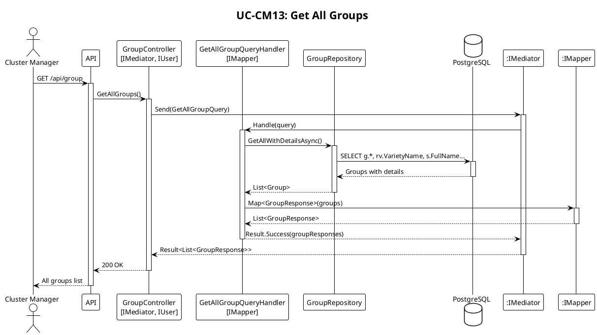
```plantuml
@startuml GetAllGroups
!theme plain
title UC-CM13: Get All Groups

actor "Cluster Manager" as CM
participant API
participant "GroupController\n[IMediator, IUser]" as GroupController
participant "GetAllGroupQueryHandler\n[IMapper]" as Handler
participant GroupRepository as Repo
database PostgreSQL as DB

CM -> API: GET /api/group
activate API

API -> GroupController: GetAllGroups()
activate GroupController

GroupController -> ":IMediator": Send(GetAllGroupQuery)
activate ":IMediator"
":IMediator" -> Handler: Handle(query)
activate Handler

Handler -> Repo: GetAllWithDetailsAsync()
activate Repo
Repo -> DB: SELECT g.*, rv.VarietyName, s.FullName...
activate DB
DB --> Repo: Groups with details
deactivate DB
Repo --> Handler: List<Group>
deactivate Repo

Handler -> ":IMapper": Map<GroupResponse>(groups)
activate ":IMapper"
":IMapper" --> Handler: List<GroupResponse>
deactivate ":IMapper"

Handler --> ":IMediator": Result.Success(groupResponses)
deactivate Handler
":IMediator" --> GroupController: Result<List<GroupResponse>>
deactivate ":IMediator"
GroupController --> API: 200 OK
deactivate GroupController
API --> CM: All groups list
deactivate API

@enduml
```

---

## UC-CM14: Get Groups By Cluster ID

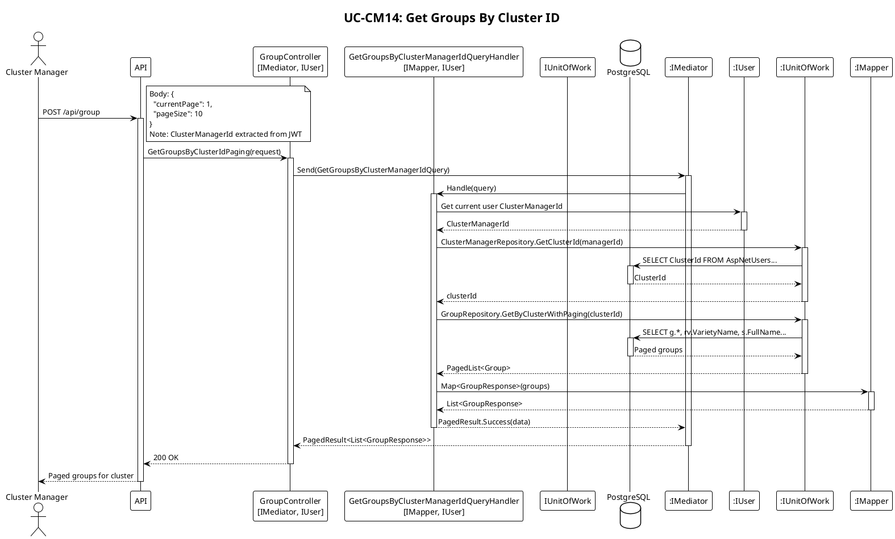
```plantuml
@startuml GetGroupsByClusterId
!theme plain
title UC-CM14: Get Groups By Cluster ID

actor "Cluster Manager" as CM
participant API
participant "GroupController\n[IMediator, IUser]" as GroupController
participant "GetGroupsByClusterManagerIdQueryHandler\n[IMapper, IUser]" as Handler
participant "IUnitOfWork" as UOW
database PostgreSQL as DB

CM -> API: POST /api/group
note right
Body: {
  "currentPage": 1,
  "pageSize": 10
}
Note: ClusterManagerId extracted from JWT
end note
activate API

API -> GroupController: GetGroupsByClusterIdPaging(request)
activate GroupController

GroupController -> ":IMediator": Send(GetGroupsByClusterManagerIdQuery)
activate ":IMediator"
":IMediator" -> Handler: Handle(query)
activate Handler

Handler -> ":IUser": Get current user ClusterManagerId
activate ":IUser"
":IUser" --> Handler: ClusterManagerId
deactivate ":IUser"

Handler -> ":IUnitOfWork": ClusterManagerRepository.GetClusterId(managerId)
activate ":IUnitOfWork"
":IUnitOfWork" -> DB: SELECT ClusterId FROM AspNetUsers...
activate DB
DB --> ":IUnitOfWork": ClusterId
deactivate DB
":IUnitOfWork" --> Handler: clusterId
deactivate ":IUnitOfWork"

Handler -> ":IUnitOfWork": GroupRepository.GetByClusterWithPaging(clusterId)
activate ":IUnitOfWork"
":IUnitOfWork" -> DB: SELECT g.*, rv.VarietyName, s.FullName...
activate DB
DB --> ":IUnitOfWork": Paged groups
deactivate DB
":IUnitOfWork" --> Handler: PagedList<Group>
deactivate ":IUnitOfWork"

Handler -> ":IMapper": Map<GroupResponse>(groups)
activate ":IMapper"
":IMapper" --> Handler: List<GroupResponse>
deactivate ":IMapper"

Handler --> ":IMediator": PagedResult.Success(data)
deactivate Handler
":IMediator" --> GroupController: PagedResult<List<GroupResponse>>
deactivate ":IMediator"
GroupController --> API: 200 OK
deactivate GroupController
API --> CM: Paged groups for cluster
deactivate API

@enduml
```

---

## UC-CM15: Get Group Detail

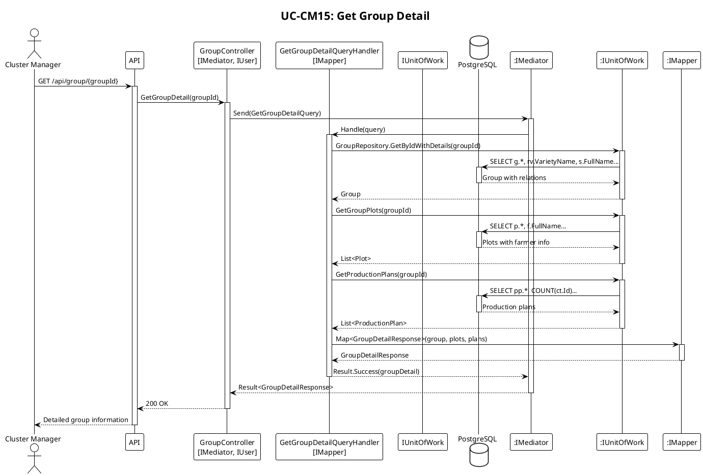
```plantuml
@startuml GetGroupDetail
!theme plain
title UC-CM15: Get Group Detail

actor "Cluster Manager" as CM
participant API
participant "GroupController\n[IMediator, IUser]" as GroupController
participant "GetGroupDetailQueryHandler\n[IMapper]" as Handler
participant "IUnitOfWork" as UOW
database PostgreSQL as DB

CM -> API: GET /api/group/{groupId}
activate API

API -> GroupController: GetGroupDetail(groupId)
activate GroupController

GroupController -> ":IMediator": Send(GetGroupDetailQuery)
activate ":IMediator"
":IMediator" -> Handler: Handle(query)
activate Handler

Handler -> ":IUnitOfWork": GroupRepository.GetByIdWithDetails(groupId)
activate ":IUnitOfWork"
":IUnitOfWork" -> DB: SELECT g.*, rv.VarietyName, s.FullName...
activate DB
DB --> ":IUnitOfWork": Group with relations
deactivate DB
":IUnitOfWork" --> Handler: Group
deactivate ":IUnitOfWork"

Handler -> ":IUnitOfWork": GetGroupPlots(groupId)
activate ":IUnitOfWork"
":IUnitOfWork" -> DB: SELECT p.*, f.FullName...
activate DB
DB --> ":IUnitOfWork": Plots with farmer info
deactivate DB
":IUnitOfWork" --> Handler: List<Plot>
deactivate ":IUnitOfWork"

Handler -> ":IUnitOfWork": GetProductionPlans(groupId)
activate ":IUnitOfWork"
":IUnitOfWork" -> DB: SELECT pp.*, COUNT(ct.Id)...
activate DB
DB --> ":IUnitOfWork": Production plans
deactivate DB
":IUnitOfWork" --> Handler: List<ProductionPlan>
deactivate ":IUnitOfWork"

Handler -> ":IMapper": Map<GroupDetailResponse>(group, plots, plans)
activate ":IMapper"
":IMapper" --> Handler: GroupDetailResponse
deactivate ":IMapper"

Handler --> ":IMediator": Result.Success(groupDetail)
deactivate Handler
":IMediator" --> GroupController: Result<GroupDetailResponse>
deactivate ":IMediator"
GroupController --> API: 200 OK
deactivate GroupController
API --> CM: Detailed group information
deactivate API

@enduml
```

---

## UC-CM16: Get Ungrouped Plots

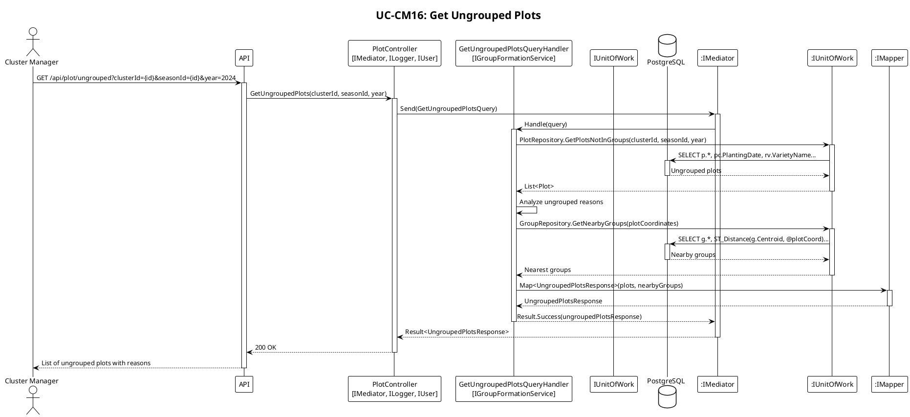
```plantuml
@startuml GetUngroupedPlots
!theme plain
title UC-CM16: Get Ungrouped Plots

actor "Cluster Manager" as CM
participant API
participant "PlotController\n[IMediator, ILogger, IUser]" as PlotController
participant "GetUngroupedPlotsQueryHandler\n[IGroupFormationService]" as Handler
participant "IUnitOfWork" as UOW
database PostgreSQL as DB

CM -> API: GET /api/plot/ungrouped?clusterId={id}&seasonId={id}&year=2024
activate API

API -> PlotController: GetUngroupedPlots(clusterId, seasonId, year)
activate PlotController

PlotController -> ":IMediator": Send(GetUngroupedPlotsQuery)
activate ":IMediator"
":IMediator" -> Handler: Handle(query)
activate Handler

Handler -> ":IUnitOfWork": PlotRepository.GetPlotsNotInGroups(clusterId, seasonId, year)
activate ":IUnitOfWork"
":IUnitOfWork" -> DB: SELECT p.*, pc.PlantingDate, rv.VarietyName...
activate DB
DB --> ":IUnitOfWork": Ungrouped plots
deactivate DB
":IUnitOfWork" --> Handler: List<Plot>
deactivate ":IUnitOfWork"

Handler -> Handler: Analyze ungrouped reasons

Handler -> ":IUnitOfWork": GroupRepository.GetNearbyGroups(plotCoordinates)
activate ":IUnitOfWork"
":IUnitOfWork" -> DB: SELECT g.*, ST_Distance(g.Centroid, @plotCoord)...
activate DB
DB --> ":IUnitOfWork": Nearby groups
deactivate DB
":IUnitOfWork" --> Handler: Nearest groups
deactivate ":IUnitOfWork"

Handler -> ":IMapper": Map<UngroupedPlotsResponse>(plots, nearbyGroups)
activate ":IMapper"
":IMapper" --> Handler: UngroupedPlotsResponse
deactivate ":IMapper"

Handler --> ":IMediator": Result.Success(ungroupedPlotsResponse)
deactivate Handler
":IMediator" --> PlotController: Result<UngroupedPlotsResponse>
deactivate ":IMediator"
PlotController --> API: 200 OK
deactivate PlotController
API --> CM: List of ungrouped plots with reasons
deactivate API

@enduml
```

---

## UC-CM17: Preview Groups

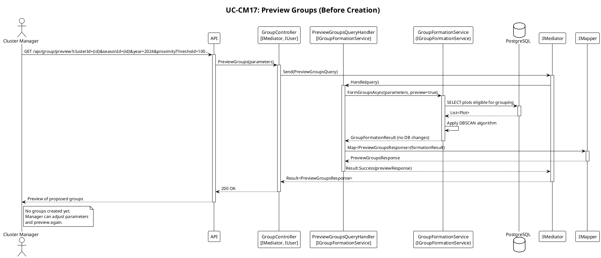
```plantuml
@startuml PreviewGroups
!theme plain
title UC-CM17: Preview Groups (Before Creation)

actor "Cluster Manager" as CM
participant API
participant "GroupController\n[IMediator, IUser]" as GroupController
participant "PreviewGroupsQueryHandler\n[IGroupFormationService]" as Handler
participant "GroupFormationService\n(IGroupFormationService)" as Service
database PostgreSQL as DB

CM -> API: GET /api/group/preview?clusterId={id}&seasonId={id}&year=2024&proximityThreshold=100...
activate API

API -> GroupController: PreviewGroups(parameters)
activate GroupController

GroupController -> ":IMediator": Send(PreviewGroupsQuery)
activate ":IMediator"
":IMediator" -> Handler: Handle(query)
activate Handler

Handler -> Service: FormGroupsAsync(parameters, preview=true)
activate Service

Service -> DB: SELECT plots eligible for grouping
activate DB
DB --> Service: List<Plot>
deactivate DB

Service -> Service: Apply DBSCAN algorithm

Service --> Handler: GroupFormationResult (no DB changes)
deactivate Service

Handler -> ":IMapper": Map<PreviewGroupsResponse>(formationResult)
activate ":IMapper"
":IMapper" --> Handler: PreviewGroupsResponse
deactivate ":IMapper"

Handler --> ":IMediator": Result.Success(previewResponse)
deactivate Handler
":IMediator" --> GroupController: Result<PreviewGroupsResponse>
deactivate ":IMediator"
GroupController --> API: 200 OK
deactivate GroupController
API --> CM: Preview of proposed groups
note right of CM
No groups created yet.
Manager can adjust parameters
and preview again.
end note
deactivate API

@enduml
```

---

## UC-CM18: Get All Plots

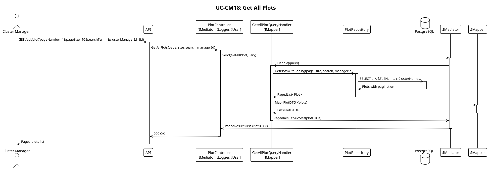
```plantuml
@startuml GetAllPlots
!theme plain
title UC-CM18: Get All Plots

actor "Cluster Manager" as CM
participant API
participant "PlotController\n[IMediator, ILogger, IUser]" as PlotController
participant "GetAllPlotQueryHandler\n[IMapper]" as Handler
participant PlotRepository as Repo
database PostgreSQL as DB

CM -> API: GET /api/plot?pageNumber=1&pageSize=10&searchTerm=&clusterManagerId={id}
activate API

API -> PlotController: GetAllPlots(page, size, search, managerId)
activate PlotController

PlotController -> ":IMediator": Send(GetAllPlotQuery)
activate ":IMediator"
":IMediator" -> Handler: Handle(query)
activate Handler

Handler -> Repo: GetPlotsWithPaging(page, size, search, managerId)
activate Repo
Repo -> DB: SELECT p.*, f.FullName, c.ClusterName...
activate DB
DB --> Repo: Plots with pagination
deactivate DB
Repo --> Handler: PagedList<Plot>
deactivate Repo

Handler -> ":IMapper": Map<PlotDTO>(plots)
activate ":IMapper"
":IMapper" --> Handler: List<PlotDTO>
deactivate ":IMapper"

Handler --> ":IMediator": PagedResult.Success(plotDTOs)
deactivate Handler
":IMediator" --> PlotController: PagedResult<List<PlotDTO>>
deactivate ":IMediator"
PlotController --> API: 200 OK
deactivate PlotController
API --> CM: Paged plots list
deactivate API

@enduml
```

---

## UC-CM19: Get Late Farmers In Cluster

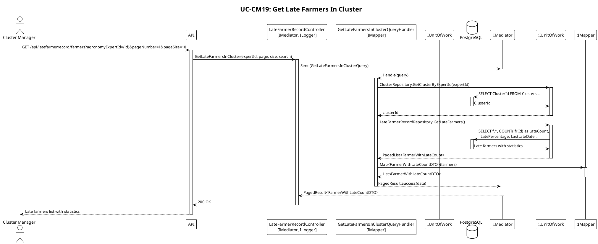
```plantuml
@startuml GetLateFarmersInCluster
!theme plain
title UC-CM19: Get Late Farmers In Cluster

actor "Cluster Manager" as CM
participant API
participant "LateFarmerRecordController\n[IMediator, ILogger]" as Controller
participant "GetLateFarmersInClusterQueryHandler\n[IMapper]" as Handler
participant "IUnitOfWork" as UOW
database PostgreSQL as DB

CM -> API: GET /api/latefarmerrecord/farmers?agronomyExpertId={id}&pageNumber=1&pageSize=10
activate API

API -> Controller: GetLateFarmersInCluster(expertId, page, size, search)
activate Controller

Controller -> ":IMediator": Send(GetLateFarmersInClusterQuery)
activate ":IMediator"
":IMediator" -> Handler: Handle(query)
activate Handler

Handler -> ":IUnitOfWork": ClusterRepository.GetClusterByExpertId(expertId)
activate ":IUnitOfWork"
":IUnitOfWork" -> DB: SELECT ClusterId FROM Clusters...
activate DB
DB --> ":IUnitOfWork": ClusterId
deactivate DB
":IUnitOfWork" --> Handler: clusterId
deactivate ":IUnitOfWork"

Handler -> ":IUnitOfWork": LateFarmerRecordRepository.GetLateFarmers()
activate ":IUnitOfWork"
":IUnitOfWork" -> DB: SELECT f.*, COUNT(lfr.Id) as LateCount,\n  LatePercentage, LastLateDate...
activate DB
DB --> ":IUnitOfWork": Late farmers with statistics
deactivate DB
":IUnitOfWork" --> Handler: PagedList<FarmerWithLateCount>
deactivate ":IUnitOfWork"

Handler -> ":IMapper": Map<FarmerWithLateCountDTO>(farmers)
activate ":IMapper"
":IMapper" --> Handler: List<FarmerWithLateCountDTO>
deactivate ":IMapper"

Handler --> ":IMediator": PagedResult.Success(data)
deactivate Handler
":IMediator" --> Controller: PagedResult<FarmerWithLateCountDTO>
deactivate ":IMediator"
Controller --> API: 200 OK
deactivate Controller
API --> CM: Late farmers list with statistics
deactivate API

@enduml
```

---

## UC-CM20: Get Late Plots In Cluster

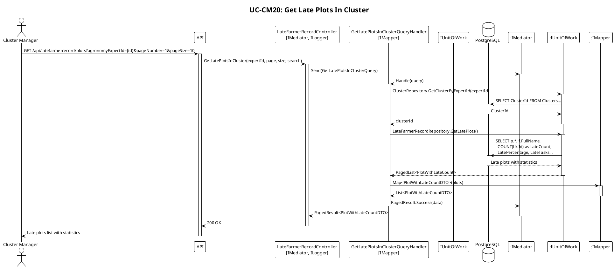
```plantuml
@startuml GetLatePlotsInCluster
!theme plain
title UC-CM20: Get Late Plots In Cluster

actor "Cluster Manager" as CM
participant API
participant "LateFarmerRecordController\n[IMediator, ILogger]" as Controller
participant "GetLatePlotsInClusterQueryHandler\n[IMapper]" as Handler
participant "IUnitOfWork" as UOW
database PostgreSQL as DB

CM -> API: GET /api/latefarmerrecord/plots?agronomyExpertId={id}&pageNumber=1&pageSize=10
activate API

API -> Controller: GetLatePlotsInCluster(expertId, page, size, search)
activate Controller

Controller -> ":IMediator": Send(GetLatePlotsInClusterQuery)
activate ":IMediator"
":IMediator" -> Handler: Handle(query)
activate Handler

Handler -> ":IUnitOfWork": ClusterRepository.GetClusterByExpertId(expertId)
activate ":IUnitOfWork"
":IUnitOfWork" -> DB: SELECT ClusterId FROM Clusters...
activate DB
DB --> ":IUnitOfWork": ClusterId
deactivate DB
":IUnitOfWork" --> Handler: clusterId
deactivate ":IUnitOfWork"

Handler -> ":IUnitOfWork": LateFarmerRecordRepository.GetLatePlots()
activate ":IUnitOfWork"
":IUnitOfWork" -> DB: SELECT p.*, f.FullName,\n  COUNT(lfr.Id) as LateCount,\n  LatePercentage, LateTasks...
activate DB
DB --> ":IUnitOfWork": Late plots with statistics
deactivate DB
":IUnitOfWork" --> Handler: PagedList<PlotWithLateCount>
deactivate ":IUnitOfWork"

Handler -> ":IMapper": Map<PlotWithLateCountDTO>(plots)
activate ":IMapper"
":IMapper" --> Handler: List<PlotWithLateCountDTO>
deactivate ":IMapper"

Handler --> ":IMediator": PagedResult.Success(data)
deactivate Handler
":IMediator" --> Controller: PagedResult<PlotWithLateCountDTO>
deactivate ":IMediator"
Controller --> API: 200 OK
deactivate Controller
API --> CM: Late plots list with statistics
deactivate API

@enduml
```

---

## API Endpoints Summary

| Use Case | Endpoint | Method | Description |
|----------|----------|--------|-------------|
| UC-CM01 | `/api/clustermanager/get-cluster-id` | GET | Get cluster ID by manager ID |
| UC-CM02 | `/api/supervisor` | POST | Create new supervisor |
| UC-CM03 | `/api/supervisor/get-supervisor-by-clustermanager-paging` | POST | Get all supervisors (paged) |
| UC-CM04 | `/api/farmer` | GET | Get all farmers (paged) |
| UC-CM05 | `/api/farmer/Detail/{id}` | GET | Get detailed farmer information |
| UC-CM06 | `/api/cluster/{id}/seasons` | GET | Get available seasons for cluster |
| UC-CM07 | `/api/cluster/{id}/current-season` | GET | Get current active season |
| UC-CM08 | `/api/cluster/{id}/history` | GET | Get historical season data |
| UC-CM09 | `/api/yearseason/by-cluster/{id}` | GET | Get all year-season instances |
| UC-CM10 | `/api/group/form` | POST | Automatically form groups |
| UC-CM11 | `/api/group/form` | POST | Form groups using PostGIS |
| UC-CM12 | `/api/group/create-manual` | POST | Manually create a group |
| UC-CM13 | `/api/group` | GET | Get all groups |
| UC-CM14 | `/api/group` | POST | Get groups by cluster (paged) |
| UC-CM15 | `/api/group/{id}` | GET | Get detailed group information |
| UC-CM16 | `/api/plot/ungrouped` | GET | Get ungrouped plots |
| UC-CM17 | `/api/group/preview` | GET | Preview group formation |
| UC-CM18 | `/api/plot` | GET | Get all plots (paged) |
| UC-CM19 | `/api/latefarmerrecord/farmers` | GET | Get late farmers in cluster |
| UC-CM20 | `/api/latefarmerrecord/plots` | GET | Get late plots in cluster |

---

## Key Architectural Patterns

### CQRS with MediatR
- **Commands**: Mutate state (Create, Update, Delete)
- **Queries**: Read data (Get, List, Search)
- Each use case has dedicated handler class
- Clean separation of concerns

### Repository Pattern
- Generic repository for common operations
- Specialized repositories for complex queries
- Unit of Work manages transactions

### PostGIS Spatial Operations
- **ST_ClusterDBSCAN**: Spatial clustering algorithm
- **ST_Distance**: Calculate distances between geometries
- **ST_Union**: Combine plot boundaries into group boundaries
- **ST_Centroid**: Find center point of groups

### Group Formation Algorithm
1. **Spatial Clustering**: Group plots by proximity using DBSCAN
2. **Temporal Clustering**: Group by similar planting dates
3. **Validation**: Check constraints (area, plot count)
4. **Optimization**: Balance supervisor workload

---

## Database Schema (Key Tables)

### Clusters
- Id, ClusterName, ClusterManagerId, AgronomyExpertId

### AspNetUsers (Discriminator Pattern)
- Farmer, Supervisor, ClusterManager, AgronomyExpert, Admin

### Plots
- Id, FarmerId, SoThua, SoTo, Area, Coordinate (Point), Boundary (Polygon)

### Groups
- Id, ClusterId, SupervisorId, RiceVarietyId, SeasonId, Year
- PlantingDate, TotalArea, Boundary (Polygon), Centroid (Point)
- IsManuallyCreated, IsException, ExceptionReason

### GroupPlots (Many-to-Many)
- GroupId, PlotId

### LateFarmerRecords
- Id, FarmerId, PlotId, CultivationTaskId, DaysLate, Reason

---

## Infrastructure Interfaces Used

All controllers and handlers depend on common infrastructure interfaces for cross-cutting concerns:

### IMediator (MediatR)
**Purpose**: Implements mediator pattern for CQRS  
**Used By**: All Controllers  
**Methods**:
- `Send<TResponse>(IRequest<TResponse>)` - Dispatch command/query to handler
- `Publish<TNotification>(INotification)` - Publish domain events

**Example**:
```csharp
// In Controller
var result = await _mediator.Send(new GetClusterIdByManagerIdQuery { ClusterManagerId = id });
```

### IMapper (AutoMapper)
**Purpose**: Object-to-object mapping (Entity to DTO)  
**Used By**: All Query Handlers  
**Methods**:
- `Map<TDestination>(source)` - Map source to destination type

**Example**:
```csharp
// In Handler
var dto = _mapper.Map<FarmerDTO>(farmerEntity);
```

### ILogger<T> (Microsoft.Extensions.Logging)
**Purpose**: Structured logging throughout application  
**Used By**: All Controllers and Handlers  
**Methods**:
- `LogInformation(message, args)` - Info level logging
- `LogWarning(message, args)` - Warning level logging
- `LogError(exception, message, args)` - Error level logging

**Example**:
```csharp
_logger.LogInformation("Creating farmer: {FullName}", request.FullName);
_logger.LogError(ex, "Error occurred while getting farmer {FarmerId}", id);
```

### IUser (Current User Context)
**Purpose**: Access current authenticated user information  
**Used By**: Controllers that need current user context  
**Properties**:
- `Id: Guid?` - Current user's ID
- `Email: string?` - Current user's email
- `Roles: IEnumerable<string>` - Current user's roles

**Example**:
```csharp
// In Controller
if (!_currentUser.Id.HasValue) {
    return Unauthorized("User not authenticated");
}
command.ClusterManagerId = _currentUser.Id;
```

### IUnitOfWork
**Purpose**: Manage database transactions and repository access  
**Used By**: All Command Handlers (write operations)  
**Methods**:
- `Repository<T>()` - Get generic repository
- `SaveChangesAsync()` - Commit transaction
- `BeginTransactionAsync()` - Start explicit transaction

**Properties**:
- `ClusterRepository`, `FarmerRepository`, `PlotRepository`, etc.

**Example**:
```csharp
// In Handler
var cluster = await _unitOfWork.ClusterRepository.GetByIdAsync(clusterId);
await _unitOfWork.SaveChangesAsync(cancellationToken);
```

### Result<T> Pattern
**Purpose**: Standardized response wrapper with success/failure state  
**Used By**: All Handlers return Result<T>  
**Properties**:
- `Succeeded: bool` - Operation success status
- `Data: T` - Response data (if successful)
- `Errors: IEnumerable<string>` - Error messages (if failed)
- `Message: string` - User-friendly message

**Example**:
```csharp
// Success
return Result<Guid>.Success(newId, "Created successfully");

// Failure
return Result<Guid>.Failure("Validation error");
```

### PagedResult<T>
**Purpose**: Pagination support for list queries  
**Extends**: Result<T>  
**Properties**:
- `CurrentPage: int`
- `PageSize: int`
- `TotalCount: int`
- `TotalPages: int`
- `HasPreviousPage: bool`
- `HasNextPage: bool`

---

## Interface Usage Matrix

| Component Type | IMediator | IMapper | ILogger | IUser | IUnitOfWork |
|----------------|-----------|---------|---------|-------|-------------|
| **Controllers** | ✅ Always | ❌ No | ✅ Always | ⚠️ Some | ❌ No |
| **Query Handlers** | ❌ No | ✅ Always | ⚠️ Some | ⚠️ Some | ✅ Read-only |
| **Command Handlers** | ⚠️ Events | ✅ Often | ✅ Always | ❌ No | ✅ Always |
| **Domain Services** | ❌ No | ❌ No | ✅ Always | ❌ No | ✅ Always |

**Legend:**
- ✅ Always used
- ⚠️ Sometimes used (context-dependent)
- ❌ Never used

---

## Dependency Injection Configuration

All interfaces are registered in the DI container:

```csharp
// Program.cs or DependencyInjection.cs
services.AddMediatR(cfg => cfg.RegisterServicesFromAssembly(Assembly.GetExecutingAssembly()));
services.AddAutoMapper(Assembly.GetExecutingAssembly());
services.AddLogging();
services.AddScoped<IUser, CurrentUser>();
services.AddScoped<IUnitOfWork, UnitOfWork>();
services.AddScoped<IGroupFormationService, GroupFormationService>();
services.AddScoped<IPostGISGroupFormationService, PostGISGroupFormationService>();
```

---

*Generated for SRPW-AI-BE Project*  
*Cluster Manager Use Cases*  
*Date: December 14, 2025*

